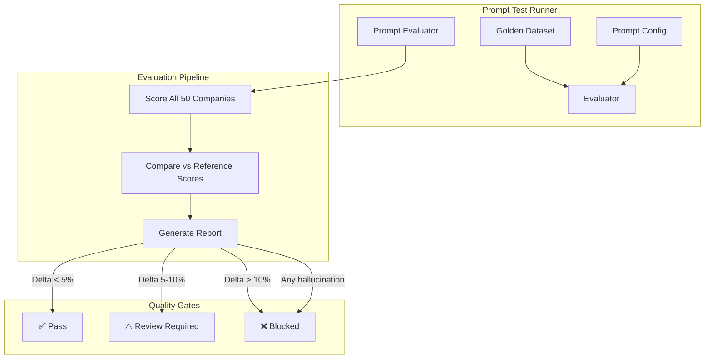

# Prompt Testing

Prompt testing is the most critical quality assurance discipline for the Jasfo Lead Intelligence Platform. Unlike traditional software tests where expected outputs are deterministic, AI prompt outputs require statistical evaluation against a curated golden dataset. The prompt testing framework evaluates scoring prompts on accuracy, consistency, and hallucination rate — ensuring that every change to prompt templates, model parameters, or scoring methodology maintains or improves output quality.

## Prompt Test Architecture



The test runner iterates over all 50 companies in the golden dataset, submits each to the scoring prompt, and compares the returned scores against the manually verified reference scores. Results are aggregated into a pass/warning/fail decision that gates the deployment.

## Golden Dataset Evaluation

The primary prompt test evaluates the scoring prompt against the full golden dataset:

```python
# tests/prompts/test_scoring_prompt.py
import pytest
import csv
from pathlib import Path

GOLDEN_DATASET = Path("tests/prompts/golden_dataset.csv")

class TestScoringPromptAgainstGoldenDataset:
    """Evaluates scoring prompt accuracy against manually scored companies."""

    def load_golden_dataset(self):
        companies = []
        with open(GOLDEN_DATASET) as f:
            reader = csv.DictReader(f)
            for row in reader:
                companies.append({
                    "name": row["company_name"],
                    "website": row["website"],
                    "city": row["city"],
                    "reference_score": float(row["reference_score"]),
                    "reference_pillars": json.loads(row["reference_pillars"]),
                    "confidence": row["confidence"],
                })
        return companies

    @pytest.mark.prompt
    async def test_mean_absolute_error_within_threshold(self):
        """Mean absolute error against reference scores must be < 5 points."""
        companies = self.load_golden_dataset()
        errors = []
        
        for company in companies:
            score = await run_scoring_prompt(
                company_name=company["name"],
                website=company["website"],
                city=company["city"],
            )
            error = abs(score["overall_score"] - company["reference_score"])
            errors.append(error)
        
        mae = sum(errors) / len(errors)
        assert mae < 5.0, f"MAE {mae:.2f} exceeds threshold of 5.0"

    @pytest.mark.prompt
    async def test_no_hallucinated_pillars(self):
        """The prompt must not return pillar scores that lack evidence."""
        companies = self.load_golden_dataset()
        
        for company in companies:
            score = await run_scoring_prompt(**company)
            
            for pillar_name, pillar_score in score["pillars"].items():
                if pillar_score is not None and pillar_score > 0:
                    # Verify evidence exists for this pillar
                    evidence = score.get("evidence", {}).get(pillar_name)
                    assert evidence, (
                        f"Hallucination detected: {company['name']} has "
                        f"score {pillar_score} for {pillar_name} but no evidence"
                    )
                    # Evidence must be substantive (at least 20 chars)
                    assert len(evidence) > 20, (
                        f"Evidence too short for {company['name']} / {pillar_name}: {evidence}"
                    )
```

## A/B Prompt Comparison

When modifying prompt templates, the A/B comparison test determines whether the new prompt (B) performs better than or equal to the current prompt (A):

```python
# tests/prompts/test_ab_comparison.py

class TestPromptABComparison:
    """A/B comparison between current and candidate prompts."""

    @pytest.mark.prompt
    @pytest.mark.slow
    async def test_candidate_prompt_not_worse_than_baseline(self):
        """Candidate prompt (B) must not degrade accuracy vs current prompt (A)."""
        companies = GoldenDataset.load()
        
        # Score with current prompt
        scores_a = await score_all_companies(companies, prompt_version="current")
        
        # Score with candidate prompt
        scores_b = await score_all_companies(companies, prompt_version="candidate")
        
        # Compute metrics for each
        mae_a = mean_absolute_error(scores_a, companies)
        mae_b = mean_absolute_error(scores_b, companies)
        
        # Candidate must not be worse by more than 2%
        max_allowed = mae_a * 1.02
        assert mae_b <= max_allowed, (
            f"Candidate MAE ({mae_b:.2f}) exceeds baseline ({mae_a:.2f}) + 2%"
        )

    @pytest.mark.prompt
    async def test_candidate_pillar_improvement(self):
        """Candidate prompt must improve or maintain each pillar accuracy."""
        companies = GoldenDataset.load()
        scores_a = await score_all_companies(companies, prompt_version="current")
        scores_b = await score_all_companies(companies, prompt_version="candidate")
        
        pillars = ["management", "growth", "culture", "technology", 
                   "financial_health", "market_position", "operations", "risk"]
        
        for pillar in pillars:
            mae_a = pillar_mae(scores_a, companies, pillar)
            mae_b = pillar_mae(scores_b, companies, pillar)
            
            # Allow 5% regression per pillar
            assert mae_b <= mae_a * 1.05, (
                f"Candidate worsened {pillar}: MAE {mae_b:.2f} vs {mae_a:.2f}"
            )
```

## Hallucination Detection

Hallucination detection verifies that scoring outputs are grounded in the available evidence and do not invent data:

```python
# tests/prompts/test_hallucination.py

class TestHallucinationDetection:
    """Tests for scoring prompt hallucination rate."""

    @pytest.mark.prompt
    async def test_hallucination_rate_below_threshold(self):
        """Hallucination rate across golden dataset must be below 2%."""
        companies = GoldenDataset.load()
        
        total_pillars = 0
        hallucinations = 0
        
        for company in companies:
            score = await run_scoring_prompt(**company)
            
            for pillar, data in score["pillars"].items():
                total_pillars += 1
                if data.get("score") and not data.get("evidence"):
                    hallucinations += 1
        
        rate = (hallucinations / total_pillars) * 100
        assert rate < 2.0, f"Hallucination rate {rate:.1f}% exceeds 2% threshold"

    @pytest.mark.prompt
    async def test_confidence_matches_evidence_volume(self):
        """Low-confidence scores must have fewer evidence sources."""
        companies = GoldenDataset.load()
        
        for company in companies:
            score = await run_scoring_prompt(**company)
            
            evidence_count = len(score.get("evidence_sources", []))
            confidence = score.get("confidence")
            
            if evidence_count < 2:
                assert confidence == "low", (
                    f"{company['name']}: {evidence_count} sources but "
                    f"confidence is {confidence}"
                )
```

## Prompt Regression Suite

A lightweight regression suite runs every hour in production to detect scoring drift:

```python
# tests/prompts/regression.py

class HourlyPromptRegression:
    """Quick hourly check to detect prompt scoring drift."""

    COMPANIES_PER_RUN = 5  # Sample 5 companies each hour
    
    async def run_regression_check(self):
        companies = GoldenDataset.sample(self.COMPANIES_PER_RUN)
        results = []
        
        for company in companies:
            score = await run_scoring_prompt(**company)
            delta = abs(score["overall_score"] - company["reference_score"])
            results.append({"company": company["name"], "delta": delta})
        
        avg_delta = sum(r["delta"] for r in results) / len(results)
        
        if avg_delta > 5.0:
            await send_alert(
                f"Prompt regression detected: avg delta {avg_delta:.2f}"
            )
        
        return results
```

## Running Prompt Tests

```bash
# Run full prompt evaluation (takes ~30 minutes for 50 companies)
pytest tests/prompts/ -v

# Run quick evaluation (sample 5 companies)
pytest tests/prompts/ -v -k "quick"

# Run A/B comparison
pytest tests/prompts/test_ab_comparison.py -v

# Run hallucination detection only
pytest tests/prompts/test_hallucination.py -v

# Run with OpenAI model version override
OPENAI_MODEL=gpt-4o-mini pytest tests/prompts/ -v
```

## Prompt Test Metrics

| Metric | Threshold | Measurement |
|---|---|---|
| Mean Absolute Error | < 5 points | Average delta from reference scores |
| Hallucination Rate | < 2% | Pillars scored without evidence |
| Pillar Coverage | ≥ 6 of 8 | Average pillars scored per company |
| Confidence Accuracy | ≥ 80% | Confidence level matches evidence volume |
| A/B Regression | ≤ 2% | Candidate prompt not worse than baseline |
| Runtime | < 60 seconds | Average time to score one company |
