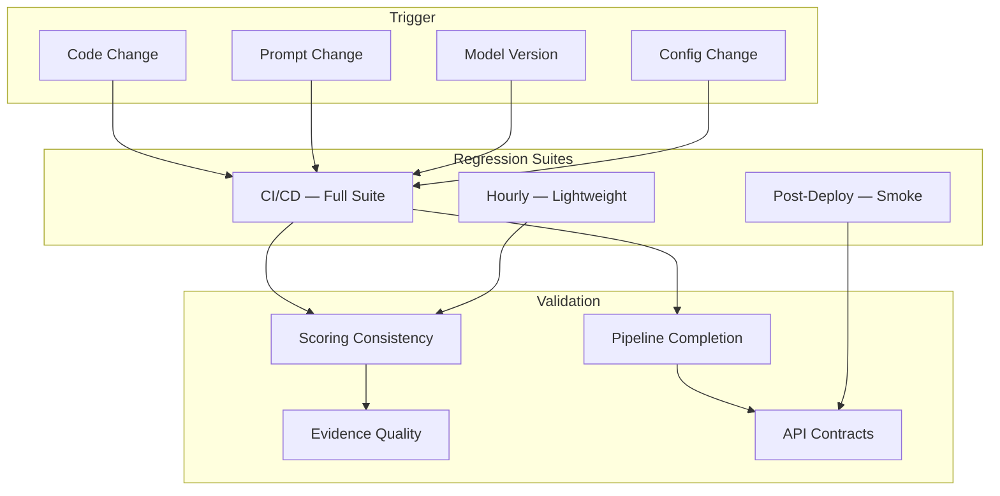

# Regression Testing

Regression testing ensures that changes to the Jasfo Lead Intelligence Platform — whether code modifications, prompt template updates, model version changes, or configuration adjustments — do not degrade existing functionality or scoring quality. The regression suite runs automatically as part of the CI/CD pipeline on every push to `staging` and `main`, and a lightweight hourly regression monitors production scoring stability.

## Regression Testing Strategy



Three regression suites operate at different frequencies and depths:

| Suite | Frequency | Coverage | Duration | Blocking |
|---|---|---|---|---|
| CI/CD Full | Every push to `staging`/`main` | All tests | ~45 minutes | Yes — blocks merge |
| Hourly | Every hour in production | Scoring consistency (5 companies) | ~5 minutes | No — alerts only |
| Post-Deploy | After every deploy | Smoke (critical endpoints) | ~30 seconds | Yes — auto-rollback |

## Scoring Consistency Regression

The most important regression check validates that scoring outputs remain consistent over time. This is critical because changes to prompt templates, model parameters, or even the underlying LLM version can silently alter scoring behavior:

```python
# tests/regression/test_scoring_consistency.py
import pytest

class TestScoringConsistency:
    """Ensures scoring output is consistent across changes."""

    CONSISTENCY_COMPANIES = [
        "Acme Analytics",
        "Main Street Bakery",
        "GrowthForce Inc",
        "TechNova Solutions",
        "Harbor Freight Logistics",
    ]

    @pytest.mark.regression
    async def test_overall_score_drift_within_threshold(self, staging_client):
        """Overall scores for landmark companies must not drift > 5%."""
        previous_scores = load_previous_scores(self.CONSISTENCY_COMPANIES)
        
        for company_name in self.CONSISTENCY_COMPANIES:
            response = await staging_client.post("/api/score", json={
                "company_name": company_name,
                "website": get_company_website(company_name),
            })
            pipeline_id = response.json()["pipeline_id"]
            await wait_for_pipeline(staging_client, pipeline_id)
            
            score_response = await staging_client.get(
                f"/api/pipeline/{pipeline_id}/scores"
            )
            current_score = score_response.json()["overall_score"]
            previous = previous_scores[company_name]
            
            drift = abs(current_score - previous) / previous * 100
            assert drift < 5.0, (
                f"{company_name}: score drifted {drift:.1f}% "
                f"(was {previous:.1f}, now {current_score:.1f})"
            )

    @pytest.mark.regression
    async def test_pillar_score_stability(self, staging_client):
        """Individual pillar scores must not change by more than 10 points."""
        previous = load_previous_pillar_scores(self.CONSISTENCY_COMPANIES)
        
        for company_name in self.CONSISTENCY_COMPANIES:
            score = await get_current_scores(staging_client, company_name)
            
            for pillar in score["pillars"]:
                current_val = score["pillars"][pillar]
                previous_val = previous[company_name][pillar]
                
                if current_val is not None and previous_val is not None:
                    change = abs(current_val - previous_val)
                    assert change <= 10, (
                        f"{company_name}/{pillar}: changed by {change} points"
                    )
```

## Evidence Quality Regression

Beyond score values, regression tests validate that the quality of scoring evidence remains consistent:

```python
# tests/regression/test_evidence_quality.py

class TestEvidenceQuality:
    """Ensures evidence quality does not degrade over time."""

    @pytest.mark.regression
    async def test_evidence_length_not_decreasing(self, staging_client):
        """Average evidence length must not decrease significantly."""
        current = await collect_evidence_stats(staging_client, 
                                               companies=self.CONSISTENCY_COMPANIES)
        baseline = load_evidence_baseline()
        
        avg_current = current["avg_evidence_length"]
        avg_baseline = baseline["avg_evidence_length"]
        
        # Allow 15% decrease
        min_acceptable = avg_baseline * 0.85
        assert avg_current >= min_acceptable, (
            f"Evidence length decreased: {avg_current:.0f} chars "
            f"(baseline: {avg_baseline:.0f}, min: {min_acceptable:.0f})"
        )

    @pytest.mark.regression
    async def test_empty_evidence_rate(self, staging_client):
        """Rate of companies with empty evidence must remain below 5%."""
        results = await score_companies(staging_client)
        empty_evidence = [
            r for r in results 
            if not r.get("evidence") or len(r["evidence"]) == 0
        ]
        rate = len(empty_evidence) / len(results) * 100
        assert rate < 5.0, (
            f"{rate:.1f}% of companies have empty evidence "
            f"(threshold: 5%)"
        )
```

## CI/CD Regression Suite

The full CI/CD regression suite runs on every merge to `staging` and `main`. It comprises:

1. **Unit Regression** — All unit tests pass (fast, < 2 minutes)
2. **Integration Regression** — All integration tests pass against staging environment
3. **Prompt Regression** — Golden dataset evaluation against current prompt (MAE < 5)
4. **Consistency Regression** — Landmark company scores within drift threshold
5. **API Contract Regression** — All endpoints return documented response structures
6. **Pipeline Regression** — End-to-end pipeline completes for test companies
7. **Cost Regression** — Token usage per company within budget

## Hourly Production Regression

A lightweight hourly job monitors production scoring for drift:

```pseudo
1. Select 5 random companies from the golden dataset
2. Score each using the production prompt endpoint
3. Compare scores against reference values
4. Compute average delta across all 5 companies
5. If average delta > 5 points: send alert to Telegram #alerts
6. If average delta > 10 points: flag for immediate investigation
7. Log results to performance_baselines table for trend analysis
```

This hourly check catches issues introduced by model-side changes (OpenAI model updates, prompt degradation, API changes) that were not triggered by a platform deployment.

## Regression Baseline Management

Regression baselines are stored in a version-controlled JSON file at `tests/regression/baselines/`:

```json
{
  "version": "v2.3",
  "created_at": "2026-07-01T00:00:00Z",
  "scores": {
    "Acme Analytics": {
      "overall_score": 78,
      "pillars": {
        "management": 82,
        "growth": 75,
        "culture": 80,
        "technology": 85,
        "financial_health": 72,
        "market_position": 78,
        "operations": 70,
        "risk": 76
      }
    }
  },
  "evidence": {
    "avg_evidence_length": 245,
    "empty_evidence_rate": 2.1,
    "avg_sources_per_company": 3.2
  },
  "performance": {
    "p50_score_time": 2.8,
    "p95_score_time": 8.5,
    "avg_cost_per_company": 0.0032
  }
}
```

Baselines are updated after each major release (version bump in `pyproject.toml`). The previous baseline is archived for historical comparison.

## Running Regression Tests

```bash
# Run full regression suite
pytest tests/regression/ -v

# Run scoring consistency only
pytest tests/regression/test_scoring_consistency.py -v

# Run evidence quality checks
pytest tests/regression/test_evidence_quality.py -v

# Run with baseline override (for testing against a specific version)
BASELINE_VERSION=v2.2 pytest tests/regression/ -v

# Update baselines after verified release
pytest tests/regression/ --update-baselines
```
