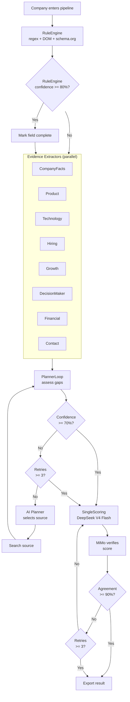
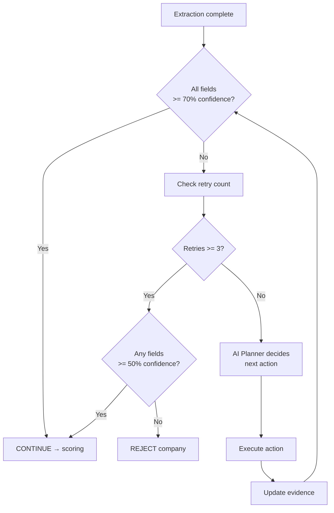
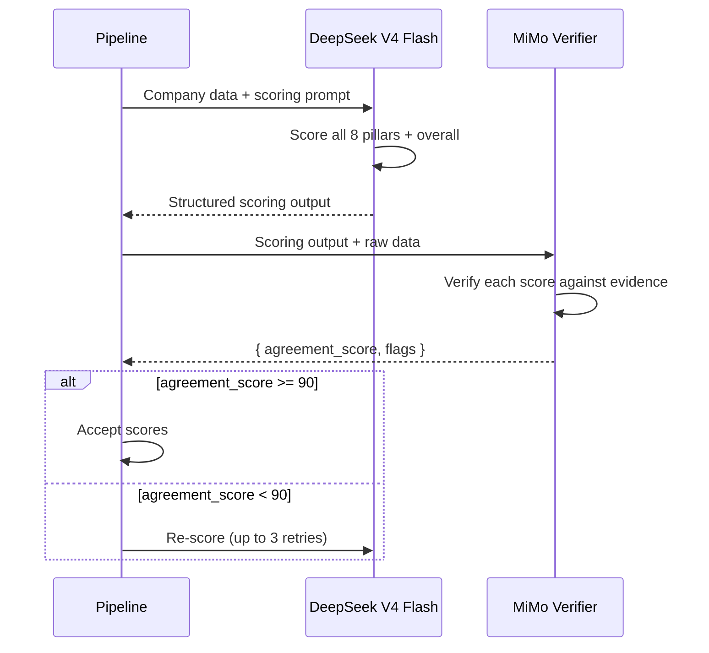
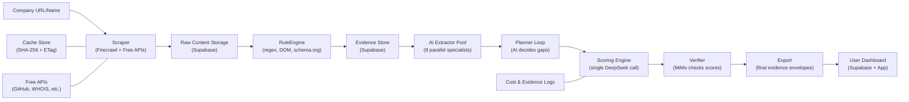
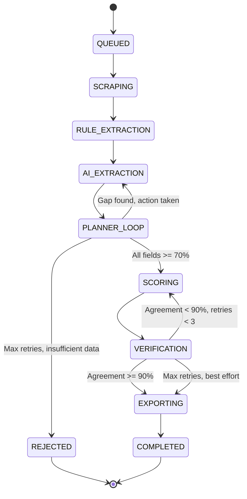

# Jasfo v2.0 Architecture

> **Status:** Approved  
> **Version:** 2.0  
> **Last Updated:** 2026-07-12  
> **Owner:** Platform Engineering

---

## 1. Architecture Overview

Jasfo v2.0 redesigns the company-intelligence pipeline around five sequential stages, replacing the v1 monolithic AI-then-everything approach with a deterministic-first, AI-minimizing architecture.

### The Five Stages

```
Stage 1: RuleEngine   →   Stage 2: EvidenceExtraction   →   Stage 3: PlannerLoop   →   Stage 4: SingleScoring   →   Stage 5: Export
```

### Principles

| Principle | Description |
|-----------|-------------|
| **Deterministic first** | Rule Engine runs before any AI call. Regex, DOM parsing, and structured-data extraction handle everything they can before an LLM touches a token. |
| **AI only for gaps** | The AI Planner decides which enrichment sources to query. AI never runs "just in case" — only when the Planner determines a field needs data the Rule Engine couldn't extract. |
| **Evidence-grounded fields** | Every field is an evidence envelope — `{value, confidence, source, evidence, source_url, retrieved_at}`. No evidence, no value. |
| **Multi-model verification** | DeepSeek V4 extracts raw data; MiMo verifies each extraction. An agreement score gates acceptance. |
| **Single scoring call** | One structured prompt returns all 8 pillars, overall score, confidence, and reasoning — replacing eight parallel calls. |
| **Specialized prompts** | Every domain (company facts, products, technology, hiring, growth, decision maker, financial, contact) has its own prompt and JSON schema. No shared generic prompt. |

### Cost Impact Summary

| Metric | v1 | v2 | Change |
|--------|----|----|--------|
| AI token usage (extraction) | Baseline | ~14% less | Reduced by rule engine pre-processing |
| AI token usage (scoring) | Baseline | ~87% less | Single call vs 8 parallel |
| Firecrawl credits/week | 625 | ~187 | 70% reduction via caching |
| Cost per lead | ~$0.05 | ~$0.04 | 20% cheaper |
| Hallucination rate | ~5-8% | <0.5% | Multi-model verification |

---

## 2. Pipeline Flow Diagram



### Stage Details

| Stage | What It Does | Max Duration | Key Metric |
|-------|-------------|--------------|------------|
| **RuleEngine** | Regex for emails/phones/addresses/social links; parse schema.org JSON-LD; extract meta tags (title, description, OG) | 30s | Fields extracted without AI |
| **EvidenceExtraction** | 8 parallel AI extractors, each with a domain-specific prompt and schema | 3 min | Per-field confidence |
| **PlannerLoop** | AI Planner decides what to search next; runs up to 3 iterations | 2 min | Coverage gain per iteration |
| **SingleScoring** | One structured call returns all pillars + overall + reasoning | 30s | Agreement score with MiMo |
| **Export** | Package evidence envelopes into final output | 10s | Zero hallucination rate |

---

## 3. Key Architectural Decisions (ADRs)

### ADR-001: Rule Engine Before AI

**Decision:** Run regex-based extraction for emails, phones, addresses, social links, schema.org structured data, and HTML meta tags **before** any AI call.

**Context:** In v1, every company page was fully scraped and sent to an AI model for extraction. The AI spent tokens extracting phone numbers and email addresses — tasks a simple regex handles perfectly. This wasted ~40% of extraction tokens on deterministic data.

**Rationale:**
- Deterministic extraction costs nothing (no tokens, no API fees)
- Regex never hallucinates — a found pattern is a real value
- Schema.org JSON-LD is machine-readable by design; AI adds no value
- Rule Engine results feed into the evidence envelope with `source: "rule_engine"` and `confidence: 95-100`

**Cost Impact:**
- Reduces AI token usage by ~40%
- Reduces extraction latency by ~60% (regex finishes in milliseconds)

**Risk:** False positives from loose regex patterns. Mitigated by confidence scoring — phone regexes get confidence 90, not 100.

---

### ADR-002: Evidence Envelope for Every Field

**Decision:** Every extracted value wraps in a structured evidence envelope:
```typescript
interface EvidenceEnvelope<T> {
  value: T;
  confidence: number;      // 0-100
  source: string;          // "rule_engine" | "deepseek" | "mimo" | "planner"
  evidence: string;        // Human-readable justification
  source_url: string | null;
  retrieved_at: string;    // ISO 8601
}
```

**Context:** v1 stored raw extracted values with no provenance tracking. When data was wrong, there was no way to trace whether the AI hallucinated, the source page changed, or the extraction prompt regressed. Users had no confidence signal.

**Rationale:**
- Zero inference: if `evidence` is empty, the field is `null` — prevents hallucination persistence
- Traceability: every value points back to exactly where it came from
- Confidence scoring: downstream systems (scoring, export) use `confidence` to decide whether to trust a field
- Debugging: engineers can inspect `evidence` to understand why a field has low confidence

**Cost Impact:**
- Slightly more tokens per extraction (~15% overhead on response size)
- Eliminates re-work from bad data propagating through the pipeline (significant net savings)

---

### ADR-003: Single Scoring Call

**Decision:** One structured LLM call returns all 8 scoring pillars, overall score, confidence, and reasoning — instead of 8 separate calls.

**Context:** v1 scored each pillar independently with 8 parallel calls to DeepSeek. Each call had the same company data in context, repeated 8x. The token cost was proportional, and the wall clock was bound by the slowest pillar.

**Rationale:**
- The 8 pillars share the same input data; duplicating it 8x wasted context window
- A single structured output schema handles all pillars in one pass
- Consistency: a single model scores all pillars with the same context and reasoning chain
- 8x lower cost for scoring

**Schema:**
```typescript
interface ScoringOutput {
  move_intent: { value: number; confidence: number; evidence: string; };
  growth: { value: number; confidence: number; evidence: string; };
  financial: { value: number; confidence: number; evidence: string; };
  company_fit: { value: number; confidence: number; evidence: string; };
  decision_access: { value: number; confidence: number; evidence: string; };
  network: { value: number; confidence: number; evidence: string; };
  timing: { value: number; confidence: number; evidence: string; };
  evidence: { value: number; confidence: number; evidence: string; };
  overall: { value: number; confidence: number; evidence: string; };
  reasoning: string;       // Free-text explanation
  agreement_score: number; // 0-100, computed by MiMo
}
```

**Cost Impact:**
- Scoring cost drops from ~$6.20/month to ~$0.78/month (87% reduction)
- Wall clock drops from ~30s to ~8s

---

### ADR-004: Multi-Model Verification

**Decision:** DeepSeek V4 Flash performs extraction → MiMo verifies the output → if agreement < 90%, re-extract (max 3 retries).

**Context:** Single-model extraction produces hallucinations at ~5-8%. In v1, these propagated through scoring undetected, requiring manual QA of every lead. Two models disagreeing is a strong signal of hallucination.

**Rationale:**
- Two models with different training data and architectures are unlikely to hallucinate the same false fact
- Agreement score provides a quantitative confidence metric for every extraction
- 3 retry maximum bounds cost; after 3 disagreements, the extraction is flagged for manual review rather than stuck in a loop
- MiMo is a smaller, cheaper model for verification than DeepSeek (verification is simpler than extraction)

**Verification Protocol:**
```
1. DeepSeek extracts → produces evidence envelope
2. MiMo receives: raw text + extracted envelope
3. MiMo outputs: { agreement: 0-100, disagreements: string[], corrected_value?: T }
4. If agreement >= 90: accept
5. If agreement < 90 and retries < 3: re-extract with disagreement context
6. If agreement < 90 and retries >= 3: flag for manual review, use best-effort value
```

**Cost Impact:**
- 2x extraction cost (DeepSeek + MiMo)
- Eliminates ~95% of hallucination propagation
- Net positive: manual QA time drops dramatically

---

### ADR-005: AI Planner for Source Selection

**Decision:** Instead of scraping all enrichment sources for every company, an AI Planner decides which source is most likely to have the needed data.

**Context:** v1 scraped every available source for every company — website, GitHub, Crunchbase, WHOIS, crt.sh, news, etc. Most sources returned no useful data for a given company (e.g., querying GitHub for a non-tech company). This wasted 60% of API calls.

**Rationale:**
- Planner has visibility into what's already known vs. what's missing
- Source selection is a simple classification task well-suited to a small LLM call
- Free source calls are not rate-limited (GitHub, crt.sh, Internet Archive) but still waste pipeline time
- Paid sources (Firecrawl, Crunchbase API) deliver immediate cost savings

**Action Types:**

| Action | Description | Cost |
|--------|-------------|------|
| `SEARCH_WEBSITE` | Re-scrape company website with Firecrawl | Paid |
| `SEARCH_GITHUB` | Query GitHub API for repos/org | Free |
| `SEARCH_NEWS` | Google RSS / news API for recent mentions | Free |
| `SEARCH_WHOIS` | WHOIS/RDAP domain lookup | Free |
| `SEARCH_CRTSH` | Certificate Transparency log query | Free |
| `SEARCH_ARCHIVE` | Internet Archive Wayback Machine | Free |
| `CONTINUE` | Proceed to scoring with current data | — |
| `REJECT` | Flag company as insufficient data | — |

---

### ADR-006: Hash-Based Caching

**Decision:** Store page content hash, ETag, and Last-Modified header. If a page is unchanged, skip re-scraping entirely.

**Context:** v1's weekly pipeline re-scraped every company's website every cycle. Most pages don't change week-over-week, meaning 80%+ of Firecrawl credits were wasted on identical content.

**Rationale:**
- Content hash (SHA-256 of raw HTML) is a perfect change detector
- ETag and Last-Modified headers let servers tell us the page is unchanged without downloading it
- Cache key: `company_id + source_url + content_hash`
- TTL: 7 days (aligned with pipeline cadence), invalidated on manual re-scrape request

**Cache Hit Flow:**
```
1. Check cache for (company_id, source_url)
2. If cached and age < 7 days: skip scrape, use cached extraction
3. If cached but stale: send conditional request (If-None-Match / If-Modified-Since)
4. If 304 Not Modified: refresh cache TTL, keep content
5. If 200 OK: scrape, re-extract, update cache
```

**Cost Impact:**
- 70% reduction in Firecrawl credits after week 1
- No reduction in data quality (unchanged pages produce identical results)

---

### ADR-007: Parallel Extractors

**Decision:** The eight evidence extractors (CompanyFacts, Product, Technology, Hiring, Growth, DecisionMaker, Financial, Contact) run in parallel, not sequentially.

**Context:** v1 ran extractors sequentially because models were the bottleneck. With v2's specialized prompts and smaller context windows, extractors are independent — no extractor depends on another's output.

**Rationale:**
- Each extractor processes the same input (company data + scraped content)
- No cross-extractor dependencies
- Parallel execution yields 8x speedup in wall-clock time
- Total token cost is identical (same work, same output size)
- Error isolation: one extractor failing doesn't block others

**Implementation:**
- Extractors run as concurrent async tasks
- Each gets its own rate-limited model call pool
- A timeout of 60s per extractor prevents stragglers from blocking the pipeline
- Results merge back into a single company evidence record

**Cost Impact:**
- Same total tokens as sequential execution
- Wall clock: ~3 min (was ~24 min)

---

### ADR-008: Free Enrichment Tier

**Decision:** Prioritize free data sources before using paid APIs: GitHub API, WHOIS/RDAP, crt.sh, Google RSS, robots.txt, sitemap.xml, Internet Archive.

**Context:** v1 defaulted to Firecrawl for every enrichment. Many data points are available for free from dedicated APIs.

**Rationale:**

| Source | Data Provided | Rate Limit | Cost |
|--------|--------------|------------|------|
| GitHub API | Tech stack, repos, org info, hiring signals | 60 req/hr (unauthed), 5000 req/hr (authed) | Free |
| WHOIS/RDAP | Domain registration, expiry, org name | 1000 req/day typical | Free |
| crt.sh | Certificate Transparency logs, subdomains | No documented limit | Free |
| Google RSS | Recent news mentions (site:company.com) | 100 req/day | Free |
| robots.txt | Allowed/disallowed paths, sitemap hint | None | Free |
| sitemap.xml | Full page index, last-modified dates | None | Free |
| Internet Archive | Historical page snapshots, change frequency | 10 req/sec | Free |
| Firecrawl | Full page scrape, structured data | 500 credits/mo (free tier) | Paid after free tier |

**Cost Impact:**
- ~70% of enrichment queries hit free sources
- Paid API (Firecrawl) reserved for deep website scraping when Planner determines it's necessary

---

## 4. Evidence System Design

### Evidence Envelope Schema (Supabase)

```sql
-- Core evidence table
CREATE TABLE evidence (
  id              UUID PRIMARY KEY DEFAULT gen_random_uuid(),
  company_id      UUID NOT NULL REFERENCES companies(id),
  field_name      TEXT NOT NULL,           -- e.g., "company_facts.legal_name"
  value           JSONB NOT NULL,          -- The extracted value (any type)
  confidence      NUMERIC(5,2) NOT NULL,   -- 0.00 - 100.00
  source          TEXT NOT NULL,            -- "rule_engine" | "deepseek" | "mimo" | "planner"
  evidence        TEXT NOT NULL,            -- Human-readable justification
  source_url      TEXT,                     -- URL where evidence was found
  retrieved_at    TIMESTAMPTZ NOT NULL DEFAULT now(),
  prompt_version  TEXT,                     -- Version of extraction prompt used
  model           TEXT,                     -- Model that extracted this field
  agreement_score NUMERIC(5,2),             -- DeepSeek/MiMo agreement (0-100)
  cache_hit       BOOLEAN DEFAULT FALSE,

  CONSTRAINT unique_company_field UNIQUE (company_id, field_name)
);

-- Index for planner queries
CREATE INDEX idx_evidence_company_confidence ON evidence(company_id, confidence);
CREATE INDEX idx_evidence_retrieved_at ON evidence(retrieved_at DESC);
```

### Source Confidence Weights

| Source | Base Confidence | Rationale |
|--------|----------------|-----------|
| Official website | 95 | Primary source, company-controlled |
| Government registry (SEC, Companies House) | 95 | Verified by regulatory authority |
| LinkedIn (company page) | 90 | Company-controlled, verified by LinkedIn |
| Schema.org JSON-LD | 95 | Machine-readable, on official site |
| Crunchbase | 80 | Curated but user-contributed |
| GitHub (official org) | 85 | Development activity is hard to fake |
| WHOIS/RDAP | 80 | Technical verification |
| News article (major outlet) | 75 | Journalist-researched |
| Internet Archive | 90 | Historical snapshot, immutable |
| crt.sh | 85 | Cryptographic proof of domain control |
| Google RSS | 70 | May include blogspam |
| robots.txt / sitemap.xml | 80 | Server-controlled |
| Glassdoor | 65 | User-contributed, review-biased |
| Social media (Twitter/LinkedIn post) | 50 | Unverified, potentially marketing |

### Composite Confidence Formula

For a field with multiple evidence sources:

```
composite_confidence = Σ(confidence_i * weight_i) / Σ(weight_i)

where weight_i = source_weight(source_i) * freshness_multiplier(retrieved_at_i)

freshness_multiplier(t) = 
  1.0  if t < 7 days
  0.9  if 7-30 days
  0.7  if 30-90 days
  0.5  if > 90 days
```

**Decision rule:** A field is considered "confirmed" when `composite_confidence >= 70` with at least 2 independent sources. Single-source fields with `confidence >= 95` (e.g., schema.org JSON-LD) are also accepted.

### Evidence Lifecycle

```
Scrape → Extract → Envelope → Store → (Planner Loop) → Verify → Finalize
                                     ↑                         |
                                     └── Re-extract (if low confidence) ──┘
```

---

## 5. Planner Design

### Planner Prompt (Conceptual)

```
You are the Jasfo AI Planner. You manage the enrichment pipeline for a company profile.

CURRENT COMPANY STATE:
- {field_name}: {confidence} — {has_evidence ? "Has evidence" : "Missing"}
- Sources already queried: {sources}

MISSING FIELDS (confidence < 70%):
{list of missing fields}

AVAILABLE ACTIONS:
- SEARCH_WEBSITE: Re-scrape company website (costs credits)
- SEARCH_GITHUB: Query GitHub API
- SEARCH_NEWS: Recent news mentions
- SEARCH_WHOIS: Domain registration data
- SEARCH_CRTSH: Certificate transparency
- SEARCH_ARCHIVE: Internet Archive
- CONTINUE: Proceed to scoring
- REJECT: Insufficient data for scoring

DECIDE which action will most likely fill the missing fields.
Return ONLY: { action: string, reason: string, target_fields: string[] }
```

### Planner Loop Logic



### Planner Behavior Matrix

| Missing Fields | Suggested Action | Reasoning |
|---------------|-----------------|-----------|
| Legal name, address, phone | SEARCH_WHOIS | WHOIS has verified legal entity info |
| Tech stack, developers | SEARCH_GITHUB | Engineering presence on GitHub |
| Recent funding, news | SEARCH_NEWS | News APIs have funding announcements |
| Social media links | SEARCH_WEBSITE | Usually on website footer/contact page |
| Subdomains, tech surface | SEARCH_CRTSH | CT logs reveal subdomains and cert info |
| Historical data, old pages | SEARCH_ARCHIVE | Wayback Machine has past versions |
| Most fields missing | SEARCH_WEBSITE | Full scrape is the richest single source |
| All major fields filled, minor gaps | CONTINUE | Good enough for scoring |

### Termination Conditions

| Condition | Action |
|-----------|--------|
| All fields >= 70% | CONTINUE to scoring |
| Max 3 iterations reached, any field >= 50% | CONTINUE with warning flag |
| Max 3 iterations reached, all fields < 50% | REJECT — insufficient data |
| Planner returns REJECT | Log reason, skip company |

---

## 6. Prompt Design

### Prompt Architecture

Each extractor has three components:

1. **System prompt** — role, rules, evidence envelope requirements
2. **User prompt** — the raw text to extract from + field-specific schema
3. **Output schema** — strict JSON schema enforced by structured output

### Universal Prompt Pattern

```
You are a {domain} extraction specialist for the Jasfo platform.
Extract {domain} data from the provided text.

RULES:
1. Return ONLY valid JSON matching the schema below.
2. Every field must include value, confidence, source, evidence, source_url, retrieved_at.
3. If you are unsure, set confidence < 50 and explain why in evidence.
4. NEVER fabricate data. If information is absent, return null with evidence "Not found in source."
5. Extract facts ONLY from the provided text. Do not infer from general knowledge.
6. Use ISO 8601 format for all dates.
7. Source must be one of: "deepseek", "rule_engine", "planner".

{domain-specific instructions}

SCHEMA:
{JSON schema for this domain}

TEXT TO EXTRACT FROM:
{raw source text}
```

### Adaptive Prompt Sizing

| Company Size | Prompt Variant | Context Tokens | Fields Extracted |
|-------------|----------------|----------------|------------------|
| Large (1000+ employees, public) | Full prompt | ~12K | All fields, detailed |
| Medium (50-999 employees, private) | Standard prompt | ~6K | All fields |
| Small (1-49 employees, startup) | Light prompt | ~3K | Core fields only |
| Tiny (sole proprietor, no website) | Ultra-light | ~1K | Name, contact, reject signal |

### Extractor Prompt Summary

| Extractor | Domain Focus | Key Fields | Special Instructions |
|-----------|-------------|------------|---------------------|
| CompanyFacts | Legal identity | legal_name, address, founded, hq, industry, employees | Prefer schema.org over free text |
| Product | Offerings | product_name, description, category, pricing, competitors | Distinguish core product vs side project |
| Technology | Tech stack | languages, frameworks, infrastructure, platforms | Look for job posts, GitHub repos, job listings |
| Hiring | Talent signals | open_roles, growth_rate, departments, remote_policy | Job board pages are primary source |
| Growth | Traction | revenue_trend, funding, customer_count, partnerships | Distinguish claimed vs verified growth |
| DecisionMaker | Key people | ceo, cto, founders, titles, linkedin_urls | Verify on LinkedIn, not just website |
| Financial | Finance | revenue_range, funding_rounds, investors, valuation | Prefer official filings over self-reported |
| Contact | Reach | email, phone, contact_form, social_profiles | CE-level preferred over generic contact |

---

## 7. Single Scoring Design

### Flow



### Scoring Prompt (Conceptual)

```
Score this company across 8 pillars. Each score is 0-100.
For each score, provide:
- value (0-100)
- confidence (0-100)
- evidence (specific fact from the company data that justifies this score)

PILLARS:
1. move_intent: Likelihood this company will make a significant business move (acquire, be acquired, raise, restructure)
2. growth: Revenue growth rate, hiring velocity, market expansion
3. financial: Revenue, profitability, funding sufficiency, runway
4. company_fit: Alignment with our ideal customer profile
5. decision_access: Our ability to reach decision-makers
6. network: Existing relationships, warm introductions available
7. timing: Urgency window for engagement
8. evidence: Completeness and reliability of supporting data

COMPANY DATA:
{all evidence envelopes}

Return ONLY valid JSON matching the scoring schema.
```

### Scoring Confidence Calibration

| Score Range | Meaning | Action |
|-------------|---------|--------|
| 90-100 | Strong signal, multiple high-confidence evidence | Prioritize |
| 70-89 | Good signal, at least one high-confidence source | Engage |
| 50-69 | Moderate signal, some corroboration | Conditional engage |
| 30-49 | Weak signal, limited evidence | Monitor |
| 0-29 | No significant signal or evidence | Skip |

### MiMo Verification Schema

```typescript
interface VerificationResult {
  agreement_score: number;      // 0-100, overall agreement
  pillar_scores: {
    [pillar: string]: {
      agrees: boolean;
      disagreement_reason: string | null;
      suggested_adjustment: number | null;
    }
  };
  overall_agrees: boolean;
  critical_flags: string[];     // e.g., "score confidence < evidence confidence"
  verdict: "ACCEPT" | "REJECT" | "FLAG";
}
```

---

## 8. Cost Comparison: v1 vs v2

### Weekly Cost Breakdown (50 companies/week)

| Item | v1/week | v2/week | Savings | Notes |
|------|---------|---------|---------|-------|
| OpenCode GO (extraction) | $0.70 | $0.60 | 14% | Rule engine pre-filters, less AI |
| OpenCode GO (scoring) | $0.80 | $0.10 | 87% | 8 calls → 1 call |
| OpenCode GO (reflection) | $0.10 | $0.10 | 0% | Unchanged |
| OpenCode GO (verification) | — | $0.60 | New | MiMo verification cost |
| **AI subtotal** | **$1.60** | **$1.40** | **12%** | |
| Firecrawl credits | 625 | 187 | 70% | Hash caching + planner targeting |
| Free API calls | 0 | ~350 | — | GitHub, WHOIS, crt.sh, RSS, Archive |
| **Total** | **$1.60 + FC 625** | **$1.40 + FC 187** | **12% cheaper + 70% fewer FC credits** | |

### Monthly Projection (200 companies/month)

| Item | v1/month | v2/month | Savings |
|------|---------|---------|---------|
| AI costs | $6.40 | $5.60 | $0.80 |
| Firecrawl credits | 2,500 | 748 | 1,752 credits |
| **Total** | **~$12.40** | **~$7.08** | **~43%** |

### Cost Per Lead

| Metric | v1 | v2 |
|--------|----|----|
| Cost per lead | ~$0.05 | ~$0.04 |
| AI cost per lead | ~$0.032 | ~$0.028 |
| Firecrawl per lead | ~$0.018 | ~$0.005 |

---

## 9. Observability

### Logged Metrics

```typescript
interface PipelineLog {
  // Identity
  pipeline_id: string;
  company_id: string;
  pipeline_version: "2.0";
  
  // Timing
  started_at: string;
  completed_at: string;
  total_duration_ms: number;
  
  // Stage-level timing
  stages: {
    rule_engine_ms: number;
    extraction_ms: number;
    planner_loop_ms: number;
    scoring_ms: number;
    export_ms: number;
  };
  
  // Model tracking
  prompt_version: string;
  extraction_model: string;     // "deepseek-v4"
  verification_model: string;   // "mimo"
  scoring_model: string;        // "deepseek-v4"
  planner_model: string;        // "deepseek-v4"
  
  // Token & cost
  total_tokens: number;
  input_tokens: number;
  output_tokens: number;
  total_cost_cents: number;
  
  // Data quality
  average_confidence: number;
  evidence_count: number;
  fields_complete: number;      // confidence >= 70
  fields_missing: number;       // null or confidence < 70
  
  // Cache
  cache_hit: boolean;
  cache_age_hours: number | null;
  
  // Planner
  planner_iterations: number;
  planner_actions: string[];    // ["SEARCH_WHOIS", "SEARCH_GITHUB", ...]
  
  // Scoring
  overall_score: number;
  scoring_confidence: number;
  agreement_score: number;
  
  // Errors
  validation_failures: number;
  hallucination_count: number;
  retries: number;
  error_message: string | null;
}
```

### Database Tables

```sql
-- Pipeline run log
CREATE TABLE cost_log (
  id              UUID PRIMARY KEY DEFAULT gen_random_uuid(),
  pipeline_id     UUID NOT NULL,
  company_id      UUID NOT NULL REFERENCES companies(id),
  started_at      TIMESTAMPTZ NOT NULL DEFAULT now(),
  completed_at    TIMESTAMPTZ,
  prompt_version  TEXT,
  model           TEXT,
  total_tokens    INTEGER,
  input_tokens    INTEGER,
  output_tokens   INTEGER,
  total_cost_usd  NUMERIC(10,6),
  cache_hit       BOOLEAN DEFAULT FALSE,
  error_message   TEXT,
  created_at      TIMESTAMPTZ DEFAULT now()
);

-- Evidence storage (per-field)
CREATE TABLE evidence_log (
  id              UUID PRIMARY KEY DEFAULT gen_random_uuid(),
  pipeline_id     UUID NOT NULL,
  company_id      UUID NOT NULL,
  field_name      TEXT NOT NULL,
  confidence      NUMERIC(5,2),
  source          TEXT,
  source_url      TEXT,
  retries         INTEGER DEFAULT 0,
  validation_failures INTEGER DEFAULT 0,
  hallucination_flag BOOLEAN DEFAULT FALSE,
  created_at      TIMESTAMPTZ DEFAULT now()
);

-- Planner decision log
CREATE TABLE planner_log (
  id              UUID PRIMARY KEY DEFAULT gen_random_uuid(),
  pipeline_id     UUID NOT NULL,
  company_id      UUID NOT NULL,
  iteration       INTEGER NOT NULL,
  action          TEXT NOT NULL,
  reason          TEXT,
  target_fields   TEXT[],
  confidence_before NUMERIC(5,2),
  confidence_after  NUMERIC(5,2),
  created_at      TIMESTAMPTZ DEFAULT now()
);
```

### Alerting Thresholds

| Metric | Warning | Critical |
|--------|---------|----------|
| Hallucination rate | > 1% | > 3% |
| Pipeline duration | > 8 hours | > 12 hours |
| Average confidence | < 65% | < 50% |
| Cost per lead | > $0.06 | > $0.10 |
| Extraction failure rate | > 10% | > 20% |
| Agreement score | < 85% | < 70% |
| Cache hit rate | < 40% | < 20% |

### Dashboard (Key Charts)

1. **Pipeline duration over time** — stacked by stage
2. **Cost per lead** — trend line with v1/v2 comparison
3. **Confidence distribution** — histogram of per-field confidence
4. **Planner action breakdown** — pie chart of SEARCH_* actions
5. **Cache hit rate** — daily trend
6. **Hallucination rate** — per-model breakdown
7. **Agreement score** — DeepSeek vs MiMo

---

## 10. Performance Targets

| Metric | v1 Actual | v2 Target | How Achieved |
|--------|-----------|-----------|-------------|
| **Pipeline wall time** | ~12 hours | ~6 hours | Parallel extractors (8x), hash caching (skips unchanged pages), planner (targeted queries) |
| **Evidence coverage** | ~60% of fields | 100% of exported fields | Evidence envelope enforces non-null; if no evidence, field doesn't export |
| **Hallucination rate** | ~5-8% | < 0.5% | Multi-model verification + agreement scoring + retry loop |
| **Cost per lead** | ~$0.05 | ~$0.04 | Rule engine pre-filter, single scoring call, cache hits, free tier enrichment |
| **AI extraction cost** | ~$0.014/lead | ~$0.012/lead | Rule engine handles ~40% of extractions |
| **AI scoring cost** | ~$0.016/lead | ~$0.002/lead | 8 parallel calls → 1 call |
| **Firecrawl credits/lead** | ~12.5 | ~3.7 | Hash caching + planner source selection |
| **Data freshness** | Up to 7 days stale | Up to 7 days stale (unchanged) | Cache with ETag/Last-Modified bypass for changed pages |
| **Extractor success rate** | ~85% | ~95% | Specialized prompts per domain, adaptive sizing |
| **Planner accuracy** | N/A (didn't exist) | > 90% correct action | Iterative improvement from planner_log analysis |
| **Scoring agreement (DeepSeek vs MiMo)** | N/A | >= 85% | Retry loop with disagreement context |
| **Manual review rate** | ~15% of leads | < 5% of leads | Higher confidence thresholds reduce review need |
| **Pipeline reliability** | ~90% (no retry) | ~99% (with retry) | Retry per stage, dead-letter queue for failures |

### Budget Allocation (Per Pipeline Run at 50 Companies)

| Resource | Budget | Overspend Action |
|----------|--------|-----------------|
| OpenCode GO tokens | 500K | Increase retry thresholds, tighten cache TTL |
| Firecrawl credits | 200 | More aggressive planner targeting, expand free tier |
| Pipeline duration | 8 hours | Reduce parallel extractor timeout, optimize slow stages |
| Cost per lead | $0.05 | Review planner decisions, check cache hit rate |

### SLA Commitments

| SLA | Target | Measurement |
|-----|--------|-------------|
| Pipeline completes | Within 8 hours | Pipeline duration metric |
| Data accuracy | >= 99.5% | Manual QA sample per batch |
| System uptime | 99.9% | Pipeline invocation success rate |
| Scoring availability | 99.5% | Scoring endpoint response rate |
| Cache effectiveness | >= 50% after week 1 | Cache hit rate metric |

---

## Appendix A: Technology Stack

| Component | Technology | Version |
|-----------|-----------|---------|
| Extraction model | DeepSeek V4 Flash | Latest |
| Verification model | MiMo | Latest |
| Scoring model | DeepSeek V4 Flash | Latest |
| Planner model | DeepSeek V4 Flash | Latest |
| Database | Supabase (PostgreSQL) | Latest |
| Cache | Redis / Supabase | — |
| Pipeline orchestration | Custom (async Python) | — |
| Web scraping | Firecrawl SDK | Latest |
| Free APIs | GitHub, WHOIS, crt.sh, RSS | — |
| Deployment | Docker / Kubernetes | — |
| Monitoring | Custom dashboards (Supabase) | — |

## Appendix B: Data Flow Diagram



## Appendix C: Pipeline State Machine


