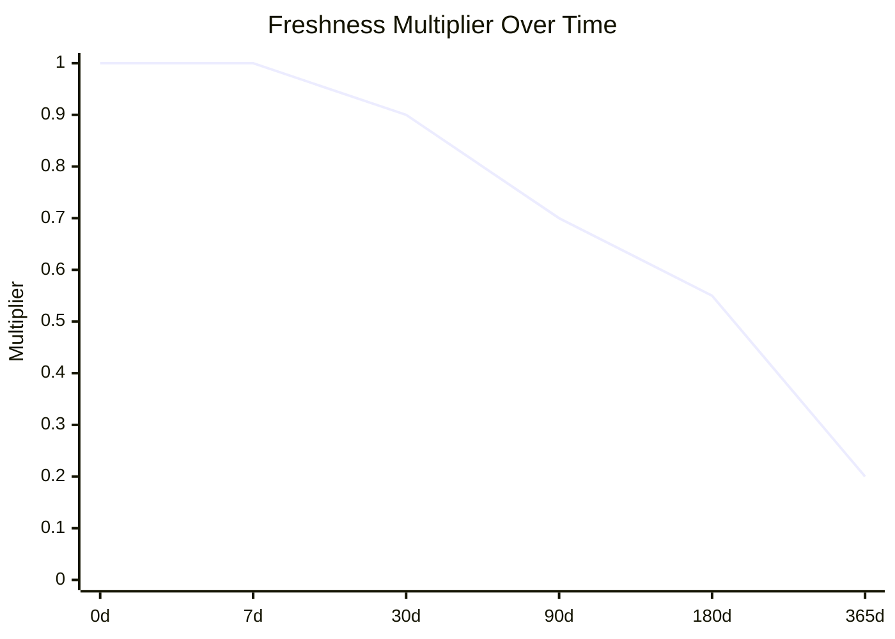
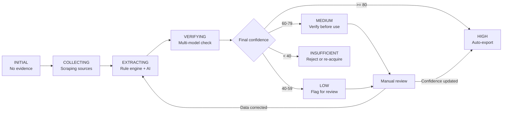

# Confidence Scoring System

> **Status:** Draft  
> **Version:** 2.0  
> **Last Updated:** 2026-07-12  
> **Owner:** Pipeline Engineering

---

## Table of Contents

1. [Composite Confidence Formula](#1-composite-confidence-formula)
2. [Confidence Factors](#2-confidence-factors)
3. [Source Reliability Weights](#3-source-reliability-weights)
4. [Freshness Multiplier](#4-freshness-multiplier)
5. [Confidence Thresholds](#5-confidence-thresholds)
6. [Independence Bonus](#6-independence-bonus)
7. [Per-Field Confidence](#7-per-field-confidence)
8. [Cross-Source Corroboration](#8-cross-source-corroboration)
9. [JavaScript Implementation](#9-javascript-implementation)
10. [Confidence Lifecycle](#10-confidence-lifecycle)
11. [Appendix: Calibration & Tuning](#11-appendix-calibration--tuning)

---

## 1. Composite Confidence Formula

The composite confidence score represents the overall reliability of a data point or company record. It is a weighted average of six independent factors, plus an optional independence bonus.

### Core Formula

```
composite_confidence = Σ(factor_score_i × factor_weight_i) / Σ(factor_weights)
```

Where:
- `factor_score_i` = 0-100 score for factor i
- `factor_weight_i` = importance weight for factor i (sum of all weights = 1.0)
- Factors with null/undefined scores are excluded from both numerator and denominator (weight renormalization)

### Independence Bonus (additive)

```
if independent_sources >= 2: composite_confidence += 10
if independent_sources >= 3: composite_confidence += 5  // cumulative: +15 total

composite_confidence = min(composite_confidence, 100)  // cap at 100
```

### Formula Diagram

```mermaid
flowchart LR
    SR[Source Reliability<br/>Score: 0-100] --> M1[× 0.25]
    EC[Evidence Count<br/>Score: 0-100] --> M2[× 0.20]
    FR[Freshness<br/>Score: 0-100] --> M3[× 0.15]
    AA[AI Agreement<br/>Score: 0-100] --> M4[× 0.20]
    CO[Completeness<br/>Score: 0-100] --> M5[× 0.10]
    VS[Validation Success<br/>Score: 0-100] --> M6[× 0.10]
    
    M1 & M2 & M3 & M4 & M5 & M6 --> SUM[Σ / Σweights]
    SUM --> BONUS{Independence?}
    BONUS -->|2+ sources| PLUS10[+10]
    BONUS -->|3+ sources| PLUS15[+15]
    PLUS10 & PLUS15 --> CLAMP[min(100)]
    CLAMP --> RESULT[Final Confidence<br/>0-100]
```

### Calculation Walkthrough

**Example:** A medium-quality record with moderate corroboration.

| Factor | Score | Weight | Contribution |
|--------|-------|--------|-------------|
| Source reliability | 80 | 0.25 | 20.0 |
| Evidence count | 60 | 0.20 | 12.0 |
| Freshness | 70 | 0.15 | 10.5 |
| AI agreement | 65 | 0.20 | 13.0 |
| Completeness | 50 | 0.10 | 5.0 |
| Validation success | 90 | 0.10 | 9.0 |
| **Weighted sum** | | **1.00** | **69.5** |
| Independence bonus (2 sources) | | | +10 |
| **Final confidence** | | | **79** |

**Result:** 79/100 → MEDIUM confidence. Usable but verify critical fields.

---

## 2. Confidence Factors

### Factor Definitions

| # | Factor | Weight | Definition | Score Range |
|---|--------|--------|------------|-------------|
| 1 | **source_reliability** | 0.25 | Authority and trustworthiness of the data source | 0-100 |
| 2 | **evidence_count** | 0.20 | Number of independent evidence items supporting the value | 0-100 |
| 3 | **freshness** | 0.15 | Recency of data collection or verification | 0-100 |
| 4 | **ai_agreement** | 0.20 | Agreement between extraction and verification models | 0-100 |
| 5 | **completeness** | 0.10 | % of required fields that have populated evidence | 0-100 |
| 6 | **validation_success** | 0.10 | Did the value pass schema validation, regex checks, etc. | 0-100 |

### Factor Scoring Details

#### 2.1 source_reliability

Maps the source type to a predefined weight (see Section 3).

#### 2.2 evidence_count

```
evidence_count_score = min(count / 5 * 100, 100)
```

| Evidence Items | Score | Meaning |
|----------------|-------|---------|
| 0 | 0 | No evidence — confidence defaults to 0 |
| 1 | 20 | Single source — minimal corroboration |
| 2 | 40 | Two independent sources — some corroboration |
| 3 | 60 | Three sources — moderate corroboration |
| 4 | 80 | Four sources — strong corroboration |
| 5+ | 100 | Five or more — maximum corroboration |

#### 2.3 freshness

```
freshness_score = age_multiplier(age_days) × 100
```

See Section 4 for the freshness multiplier table.

#### 2.4 ai_agreement

```
ai_agreement_score = agreement_pct  // 0-100, directly from MiMo verification
```

| Agreement | Score | Meaning |
|-----------|-------|---------|
| 90-100% | 90-100 | Strong agreement — high confidence |
| 70-89% | 70-89 | Moderate agreement — some differences |
| 50-69% | 50-69 | Weak agreement — significant differences |
| < 50% | < 50 | Disagreement — low confidence, needs review |

#### 2.5 completeness

```
completeness_score = (fields_with_evidence / total_required_fields) × 100
```

Fields with `evidence = "Not found in source"` or `value = null` count as incomplete.

#### 2.6 validation_success

```
validation_success_score = (passed_validations / total_validations) × 100
```

| Scenario | Score | Example |
|----------|-------|---------|
| All validations passed | 100 | Email matched regex, domain resolved |
| Format warning | 80 | Phone number has extra characters |
| Schema mismatch | 50 | Type coercion needed |
| Validation failed | 0 | Email invalid format, domain NXDOMAIN |

---

## 3. Source Reliability Weights

Maps each data source to a 0-100 reliability score based on provenance, verification level, and authority.

### Full Source Table

| Source | Weight | Verification Level | Notes |
|--------|--------|-------------------|-------|
| Official website (direct scrape) | 95 | Primary | Company-controlled content |
| Government registry (SEC, MCA, Companies House) | 95 | Regulatory | Verified by law |
| Schema.org JSON-LD (from official site) | 95 | Machine-readable | Structured data, hard to fake |
| LinkedIn Company page | 90 | Semi-verified | LinkedIn verification badge |
| GitHub official organization | 85 | Technical | Repos, org members, activity |
| Certificate Transparency (crt.sh) | 85 | Cryptographic | Proof of domain ownership |
| WHOIS / RDAP | 80 | Registry | Domain registration data |
| Press release (official) | 80 | Published | Company-vetted announcement |
| Sitemap.xml / robots.txt | 80 | Server | Server-controlled files |
| Internet Archive (Wayback Machine) | 80 | Historical | Immutable snapshot |
| Crunchbase (free tier) | 75 | Curated | User-contributed but moderated |
| News article (major outlet) | 70 | Journalist | Professional journalism |
| OpenCorporates | 70 | Registry | Open company data |
| Google Maps / Places | 70 | Verified | Business listing with verification |
| Common Crawl index | 65 | Crawled | Automated web crawl |
| Business directory (Yellow Pages, Clutch) | 60 | Curated | User-contributed listing |
| RSS feed / Google News | 50 | Aggregated | Automated aggregation |
| HackerNews (Algolia) | 45 | Community | User-submitted content |
| Blog (personal/company) | 40 | Self-published | Marketing or opinion |
| Social media post | 30 | Unverified | Public social content |
| User-provided (manual entry) | 20 | Self-reported | No verification |
| Unknown / uncategorized | 20 | Unknown | No provenance |

### Source Category Aggregation

When a record is sourced from multiple sources, calculate a weighted average:

```
reliability_score = Σ(source_weight_i) / source_count
```

For multi-source records, use the **average** (not max) to penalize weak sources dragging down overall reliability. If a company is found on LinkedIn (90) and a blog (40), the reliability is (90 + 40) / 2 = 65, not 90.

### JavaScript: Source Reliability Lookup

```javascript
// n8n Code Node: Source Reliability
// Input: { source_name: string }
// Output: { weight: 0-100, category: string }

const SOURCE_WEIGHTS = {
  // Official / primary
  'official_website':          { weight: 95, category: 'primary' },
  'government_registry':       { weight: 95, category: 'regulatory' },
  'json_ld':                   { weight: 95, category: 'primary' },
  'schema_org':                { weight: 95, category: 'primary' },
  
  // Professional platforms
  'linkedin':                  { weight: 90, category: 'semi_verified' },
  'linkedin_company':          { weight: 90, category: 'semi_verified' },
  'github':                    { weight: 85, category: 'technical' },
  
  // Technical verification
  'crt.sh':                    { weight: 85, category: 'cryptographic' },
  'certificate_transparency':  { weight: 85, category: 'cryptographic' },
  'whois':                     { weight: 80, category: 'registry' },
  'rdap':                      { weight: 80, category: 'registry' },
  'dns':                       { weight: 80, category: 'technical' },
  
  // Published content
  'press_release':             { weight: 80, category: 'published' },
  'sitemap':                   { weight: 80, category: 'server' },
  'robots_txt':                { weight: 80, category: 'server' },
  'internet_archive':          { weight: 80, category: 'historical' },
  'wayback_machine':           { weight: 80, category: 'historical' },
  
  // Curated data
  'crunchbase':                { weight: 75, category: 'curated' },
  'news_major':                { weight: 70, category: 'journalist' },
  'opencorporates':            { weight: 70, category: 'registry' },
  'google_maps':               { weight: 70, category: 'verified_listing' },
  'google_places':             { weight: 70, category: 'verified_listing' },
  
  // Crawled / directory
  'common_crawl':              { weight: 65, category: 'crawled' },
  'yellow_pages':              { weight: 60, category: 'directory' },
  'clutch':                    { weight: 60, category: 'directory' },
  'goodfirms':                 { weight: 60, category: 'directory' },
  'tradeindia':                { weight: 60, category: 'directory' },
  'indiamart':                 { weight: 60, category: 'directory' },
  'justdial':                  { weight: 60, category: 'directory' },
  
  // Aggregated / feed
  'google_news':               { weight: 50, category: 'aggregated' },
  'rss':                       { weight: 50, category: 'aggregated' },
  'news_api':                  { weight: 50, category: 'aggregated' },
  'hackernews':                { weight: 45, category: 'community' },
  
  // Self-published
  'blog':                      { weight: 40, category: 'self_published' },
  'company_blog':              { weight: 40, category: 'self_published' },
  
  // Social / unverified
  'twitter':                   { weight: 30, category: 'social' },
  'social_media':              { weight: 30, category: 'social' },
  'facebook':                  { weight: 30, category: 'social' },
  'instagram':                 { weight: 30, category: 'social' },
  
  // Low provenance
  'user_provided':             { weight: 20, category: 'self_reported' },
  'manual_entry':              { weight: 20, category: 'self_reported' },
  'unknown':                   { weight: 20, category: 'unknown' }
};

function getSourceReliability(sourceName) {
  const key = (sourceName || '').toLowerCase().trim();
  return SOURCE_WEIGHTS[key] || SOURCE_WEIGHTS['unknown'];
}

function averageSourceReliability(sourceNames) {
  if (!sourceNames || sourceNames.length === 0) return 20;
  let total = 0;
  for (const name of sourceNames) {
    total += getSourceReliability(name).weight;
  }
  return Math.round(total / sourceNames.length);
}

const source = $input.first().json.source_name || 'unknown';
const sources = $input.first().json.source_names || [];

return [{
  json: {
    single_source: source,
    single_weight: getSourceReliability(source).weight,
    single_category: getSourceReliability(source).category,
    multi_sources: sources,
    average_weight: averageSourceReliability(sources)
  }
}];
```

---

## 4. Freshness Multiplier

Data decays in confidence as it ages. The freshness multiplier scales base confidence down for stale data.

### Decay Table

| Age | Multiplier | Effective Confidence (from base=100) |
|-----|-----------|--------------------------------------|
| < 7 days | 1.0 | 100 |
| 7-30 days | 0.9 | 90 |
| 30-90 days | 0.7 | 70 |
| > 90 days | 0.4 | 40 |
| > 365 days | 0.2 | 20 |

### Decay Curve



### Exponential Decay Formula

For continuous decay instead of stepwise:

```
multiplier = e^(-λ × days_since_collection)

Where λ (lambda) is configured per data type:
  - Crawl data:      λ = 0.008  (86 day half-life)
  - WHOIS:           λ = 0.003  (231 day half-life)
  - Social media:    λ = 0.015  (46 day half-life)
  - News:            λ = 0.020  (35 day half-life)
  - Hiring signals:  λ = 0.010  (69 day half-life)
```

### JavaScript: Freshness Calculator

```javascript
// n8n Code Node: Freshness Score
// Input: { retrieved_at: string (ISO 8601), lambda?: number }
// Output: { age_days: number, multiplier: number, score: number }

function calculateFreshness(retrievedAt, lambda) {
  if (!retrievedAt) return { age_days: null, multiplier: 0, score: 0 };
  
  const now = new Date();
  const retrieved = new Date(retrievedAt);
  const ageMs = now - retrieved;
  const ageDays = Math.floor(ageMs / 86400000);
  
  // Stepwise multiplier (simpler, preferred for rule engine)
  let multiplier;
  if (ageDays < 7) multiplier = 1.0;
  else if (ageDays < 30) multiplier = 0.9;
  else if (ageDays < 90) multiplier = 0.7;
  else if (ageDays < 365) multiplier = 0.4;
  else multiplier = 0.2;
  
  // Exponential decay (optional, for continuous scoring)
  const decayLambda = lambda || 0.008;
  const expMultiplier = Math.exp(-decayLambda * ageDays);
  
  return {
    age_days: ageDays,
    age_years: ageDays > 0 ? (ageDays / 365).toFixed(1) : 0,
    stepwise_multiplier: multiplier,
    exponential_multiplier: Math.round(expMultiplier * 100) / 100,
    freshness_score: Math.round(multiplier * 100),
    stale: ageDays > 90
  };
}

const retrievedAt = $input.first().json.retrieved_at || null;
const lambda = $input.first().json.lambda || null;
const result = calculateFreshness(retrievedAt, lambda);

return [{
  json: {
    retrieved_at: retrievedAt,
    ...result
  }
}];
```

---

## 5. Confidence Thresholds

### Classification Bands

| Score Range | Label | Color | Meaning | Action |
|-------------|-------|-------|---------|--------|
| 80-100 | HIGH | 🟢 Green | Trust the data | Proceed without human review |
| 60-79 | MEDIUM | 🟡 Yellow | Usable but verify | Verify critical fields before acting |
| 40-59 | LOW | 🟠 Orange | Flag for review | Require manual inspection |
| 0-39 | INSUFFICIENT | 🔴 Red | Reject or re-acquire | Discard or re-scrape from better source |

### Confidence-decoupled Actions

Confidence is independent of the lead score. A lead can score 90 with confidence 30:

| Scenario | Overall Score | Confidence | Action |
|----------|--------------|------------|--------|
| Good data, good fit | 85 | 92 | HIGH — contact immediately |
| Good data, poor fit | 30 | 95 | HIGH confidence but low score — store for later |
| Poor data, good fit | 80 | 35 | LOW confidence — manually verify before contact |
| Poor data, poor fit | 25 | 20 | INSUFFICIENT — discard |

### Pipeline Gating

| Pipeline Stage | Min Confidence | Behavior |
|---------------|----------------|----------|
| Initial qualification | — | Always runs (no confidence needed) |
| Free enrichment | 20+ | Skip if INSUFFICIENT |
| AI extraction | 40+ | Skip if below LOW; flag for review |
| Scoring | 50+ | Bypass scoring if below threshold |
| Export | 60+ | MEDIUM+ required for automatic export |
| Notification / alert | 70+ | Only HIGH-confidence leads trigger alerts |

### JavaScript: Threshold Classification

```javascript
// n8n Code Node: Confidence Classifier
// Input: { confidence: number (0-100) }
// Output: { label, color, actionable, can_export }

function classifyConfidence(confidence) {
  if (confidence >= 80) {
    return {
      label: 'HIGH',
      color: 'green',
      actionable: true,
      can_export: true,
      needs_review: false,
      description: 'Trust the data — proceed without human review'
    };
  }
  if (confidence >= 60) {
    return {
      label: 'MEDIUM',
      color: 'yellow',
      actionable: true,
      can_export: true,
      needs_review: true,
      description: 'Usable — verify critical fields before acting'
    };
  }
  if (confidence >= 40) {
    return {
      label: 'LOW',
      color: 'orange',
      actionable: false,
      can_export: false,
      needs_review: true,
      description: 'Flag for manual review — significant gaps'
    };
  }
  return {
    label: 'INSUFFICIENT',
    color: 'red',
    actionable: false,
    can_export: false,
    needs_review: false,
    description: 'Reject or re-acquire from a different source'
  };
}

const confidence = $input.first().json.confidence;
if (confidence === null || confidence === undefined) {
  return [{ json: { error: 'No confidence value provided' } }];
}

return [{
  json: {
    confidence: confidence,
    ...classifyConfidence(confidence)
  }
}];
```

---

## 6. Independence Bonus

When the same value is confirmed by multiple independent sources, confidence receives a bonus.

### Bonus Schedule

| Independent Sources | Bonus | Example |
|--------------------|-------|---------|
| 1 (single source) | +0 | One directory listing |
| 2 (two sources) | +10 | LinkedIn + official website |
| 3+ (three or more) | +15 | LinkedIn + website + Crunchbase |

### Independence Qualification

For sources to count as independent:

1. **Different platforms** — LinkedIn and Crunchbase are independent; two different directories that aggregate from the same upstream are NOT independent
2. **Different collection methods** — API call and web scrape of the same source are NOT independent
3. **Different times** — Same source scraped twice is NOT independent (use freshness instead)
4. **Same fact, different evidence** — Both must confirm the same specific value

### Source Dependency Matrix

| Source A | Source B | Independent? |
|----------|----------|-------------|
| LinkedIn Company | Official website | ✅ Yes |
| Crunchbase | Official website | ✅ Yes |
| WHOIS | crt.sh | ✅ Yes (different registries) |
| Google News | TechCrunch article | ❌ No (TechCrunch may be in Google News) |
| TradeIndia | IndiaMART | ✅ Yes (different platforms) |
| Directory listing | Company's website | ✅ Yes |
| Press release A | Press release B | ❌ No (if same source) |
| JSON-LD | HTML meta tags | ❌ No (same page) |

### JavaScript: Independence Check

```javascript
// n8n Code Node: Independence Bonus
// Input: { sources: string[], values_match: boolean }
// Output: { independent_count: number, bonus: number }

const DEPENDENCY_GROUPS = {
  'linkedin': ['linkedin', 'linkedin_company'],
  'crunchbase': ['crunchbase'],
  'official_website': ['official_website', 'json_ld', 'schema_org', 'meta_tags'],
  'whois_registry': ['whois', 'rdap'],
  'certificate': ['crt.sh', 'certificate_transparency'],
  'news_aggregator': ['google_news', 'news_api', 'rss'],
  'directory_india': ['tradeindia', 'indiamart', 'justdial'],
  'directory_global': ['yellow_pages', 'clutch', 'goodfirms'],
  'github': ['github'],
  'government': ['government_registry', 'opencorporates'],
  'archive': ['internet_archive', 'wayback_machine']
};

function getDependencyGroup(sourceType) {
  const key = sourceType.toLowerCase().trim();
  for (const [group, members] of Object.entries(DEPENDENCY_GROUPS)) {
    if (members.includes(key)) return group;
  }
  return null; // Unknown source -> unique
}

function countIndependentSources(sourceTypes) {
  if (!sourceTypes || sourceTypes.length === 0) return 0;
  
  const seenGroups = new Set();
  let independentCount = 0;
  
  for (const source of sourceTypes) {
    const group = getDependencyGroup(source);
    const dedupKey = group || source; // Use group name or raw source if unknown
    if (!seenGroups.has(dedupKey)) {
      seenGroups.add(dedupKey);
      independentCount++;
    }
  }
  
  return independentCount;
}

function calculateIndependenceBonus(sourceTypes, valuesMatch) {
  if (!valuesMatch) return { independent_count: sourceTypes?.length || 0, bonus: 0, reason: 'Values do not match' };
  
  const count = countIndependentSources(sourceTypes);
  let bonus = 0;
  if (count >= 3) bonus = 15;
  else if (count >= 2) bonus = 10;
  
  return {
    independent_count: count,
    bonus: bonus,
    reason: bonus > 0 ? `Confirmed by ${count} independent sources (+${bonus})` : 'Single source, no bonus'
  };
}

const sources = $input.first().json.sources || [];
const valuesMatch = $input.first().json.values_match !== false;
const result = calculateIndependenceBonus(sources, valuesMatch);

return [{
  json: {
    sources: sources,
    values_match: valuesMatch,
    ...result
  }
}];
```

---

## 7. Per-Field Confidence

Each individual field in a company record has its own confidence score, independent of the overall composite.

### Field-Level Formula

```
field_confidence = weighted_average of all evidence envelopes for that field
                 + independence_bonus
```

### Evidence Envelope Review

```
field_confidence = Σ(evidence_confidence_i × source_reliability_i × freshness_i)
                   / Σ(source_reliability_i × freshness_i)
```

Where each evidence envelope contributes:

```
evidence_contribution = evidence.confidence × source_weight × freshness_multiplier
```

### Field Confidence Thresholds

| Field Confidence | Meaning |
|-----------------|---------|
| >= 80 | High confidence — value is reliable |
| 60-79 | Medium confidence — usable, note the gaps |
| < 60 | Low confidence — supplement or skip |

### JavaScript: Per-Field Confidence

```javascript
// n8n Code Node: Per-Field Confidence
// Input: { field_name: string, evidence: EvidenceEnvelope[] }
// Output: { field_name, confidence, evidence_count, verdict }

function calculateFieldConfidence(fieldName, evidenceItems) {
  if (!evidenceItems || evidenceItems.length === 0) {
    return {
      field_name: fieldName,
      confidence: 0,
      evidence_count: 0,
      verdict: 'NO_EVIDENCE',
      details: []
    };
  }
  
  const SOURCE_WEIGHTS = {
    'official_website': 95, 'government_registry': 95, 'json_ld': 95,
    'linkedin': 90, 'github': 85, 'crt.sh': 85, 'whois': 80,
    'press_release': 80, 'sitemap': 80, 'internet_archive': 80,
    'crunchbase': 75, 'news_major': 70, 'opencorporates': 70,
    'google_maps': 70, 'directory': 60, 'rss': 50, 'blog': 40,
    'social_media': 30, 'unknown': 20
  };
  
  let weightedSum = 0;
  let weightSum = 0;
  const details = [];
  
  for (const ev of evidenceItems) {
    const sourceWeight = SOURCE_WEIGHTS[ev.source] || 20;
    const ageDays = ev.retrieved_at
      ? Math.floor((Date.now() - new Date(ev.retrieved_at).getTime()) / 86400000)
      : 365;
    
    let freshnessMult = 0.4;
    if (ageDays < 7) freshnessMult = 1.0;
    else if (ageDays < 30) freshnessMult = 0.9;
    else if (ageDays < 90) freshnessMult = 0.7;
    else if (ageDays < 365) freshnessMult = 0.4;
    else freshnessMult = 0.2;
    
    const combinedWeight = sourceWeight * freshnessMult;
    weightedSum += ev.confidence * combinedWeight / 100;
    weightSum += combinedWeight;
    
    details.push({
      source: ev.source,
      confidence: ev.confidence,
      age_days: ageDays,
      source_weight: sourceWeight,
      freshness_multiplier: freshnessMult,
      combined_weight: Math.round(combinedWeight),
      contribution: Math.round(ev.confidence * combinedWeight / 100)
    });
  }
  
  const rawConfidence = weightSum > 0 ? (weightedSum / weightSum) * 100 : 0;
  
  // Independence bonus
  const uniqueSources = new Set(evidenceItems.map(e => e.source)).size;
  let bonus = 0;
  if (uniqueSources >= 3) bonus = 15;
  else if (uniqueSources >= 2) bonus = 10;
  
  const finalConfidence = Math.min(100, Math.round(rawConfidence + bonus));
  
  let verdict = 'INSUFFICIENT';
  if (finalConfidence >= 80) verdict = 'HIGH';
  else if (finalConfidence >= 60) verdict = 'MEDIUM';
  else if (finalConfidence >= 40) verdict = 'LOW';
  
  return {
    field_name: fieldName,
    confidence: finalConfidence,
    evidence_count: evidenceItems.length,
    unique_sources: uniqueSources,
    independence_bonus: bonus,
    verdict: verdict,
    details: details.sort((a, b) => b.combined_weight - a.combined_weight)
  };
}

const fieldName = $input.first().json.field_name || '';
const evidence = $input.first().json.evidence || [];
const result = calculateFieldConfidence(fieldName, evidence);

return [{ json: result }];
```

---

## 8. Cross-Source Corroboration

Measures how many independent sources agree on the same value for a given field.

### Corroboration Scoring

| Agreement Level | Score | Meaning |
|----------------|-------|---------|
| All sources agree | 100 | Single consistent value across all sources |
| Majority agree | 70 | >50% of sources report the same value |
| Plurality agree | 40 | Largest group agrees, but no majority |
| All disagree | 0 | Every source reports a different value |
| Single source only | 50 | No corroboration possible — neutral score |

### Conflict Resolution

When sources disagree:

1. **Prefer higher-reliability source** — website JSON-LD beats a directory listing
2. **Prefer more recent source** — newer data beats stale data
3. **Prefer more specific value** — full address beats city-only
4. **Flag conflict for review** — if confidence-weighted difference < 20 points

### JavaScript: Corroboration Score

```javascript
// n8n Code Node: Corroboration Score
// Input: { values: string[], source_reliabilities: number[] }
// Output: { corroboration_score, dominant_value, conflict_flag }

function calculateCorroboration(values, reliabilities) {
  if (!values || values.length === 0) {
    return { corroboration_score: 0, dominant_value: null, conflict: true };
  }
  
  if (values.length === 1) {
    return { corroboration_score: 50, dominant_value: values[0], conflict: false };
  }
  
  // Count occurrences (weighted by source reliability)
  const valueWeights = {};
  for (let i = 0; i < values.length; i++) {
    const v = values[i];
    const w = (reliabilities && reliabilities[i]) || 50;
    valueWeights[v] = (valueWeights[v] || 0) + w;
  }
  
  const totalWeight = Object.values(valueWeights).reduce((a, b) => a + b, 0);
  const sorted = Object.entries(valueWeights).sort((a, b) => b[1] - a[1]);
  const dominant = sorted[0];
  const dominantPct = dominant[1] / totalWeight;
  
  let score;
  if (dominantPct >= 0.95) score = 100;   // Near-unanimous
  else if (dominantPct >= 0.60) score = 70; // Majority
  else if (sorted.length === 2 && dominantPct >= 0.45) score = 40; // Two-way split
  else score = 0; // All disagree
  
  return {
    corroboration_score: score,
    dominant_value: dominant[0],
    dominant_confidence_pct: Math.round(dominantPct * 100),
    total_sources: values.length,
    unique_values: sorted.length,
    conflict: score < 70,
    value_distribution: Object.fromEntries(
      sorted.map(([v, w]) => [v, Math.round(w / totalWeight * 100)])
    )
  };
}

const vals = $input.first().json.values || [];
const rels = $input.first().json.source_reliabilities || [];
const result = calculateCorroboration(vals, rels);

return [{ json: result }];
```

---

## 9. JavaScript Implementation

### Complete Confidence Calculator

The full confidence calculator that accepts all factors and returns the scored result:

```javascript
// n8n Code Node: Complete Confidence Calculator
// Input: { factors: { ... }, source_names: string[], retrieved_at: string }
// Output: { confidence, label, breakdown }

function calculateFullConfidence(factors, sourceNames, retrievedAt) {
  // --- Step 1: Factor scores ---
  const weights = {
    source_reliability: 0.25,
    evidence_count: 0.20,
    freshness: 0.15,
    ai_agreement: 0.20,
    completeness: 0.10,
    validation_success: 0.10
  };
  
  // Calculate source_reliability from source names if not provided directly
  if (!factors.source_reliability && sourceNames && sourceNames.length > 0) {
    const SOURCE_WEIGHTS = {
      'official_website': 95, 'government_registry': 95, 'json_ld': 95,
      'linkedin': 90, 'github': 85, 'crt.sh': 85, 'whois': 80,
      'press_release': 80, 'internet_archive': 80, 'crunchbase': 75,
      'news_major': 70, 'opencorporates': 70, 'google_maps': 70,
      'directory': 60, 'rss': 50, 'blog': 40, 'social_media': 30,
      'unknown': 20
    };
    let total = 0;
    for (const name of sourceNames) {
      total += SOURCE_WEIGHTS[name.toLowerCase().trim()] || 20;
    }
    factors.source_reliability = Math.round(total / sourceNames.length);
  }
  
  // Calculate freshness from retrieved_at if not provided directly
  if (!factors.freshness && retrievedAt) {
    const ageDays = Math.floor((Date.now() - new Date(retrievedAt).getTime()) / 86400000);
    if (ageDays < 7) factors.freshness = 100;
    else if (ageDays < 30) factors.freshness = 90;
    else if (ageDays < 90) factors.freshness = 70;
    else if (ageDays < 365) factors.freshness = 40;
    else factors.freshness = 20;
  }
  
  // --- Step 2: Weighted sum ---
  let total = 0;
  let weightSum = 0;
  const usedFactors = {};
  
  for (const [factor, weight] of Object.entries(weights)) {
    const score = factors[factor];
    if (score !== null && score !== undefined && score >= 0) {
      total += score * weight;
      weightSum += weight;
      usedFactors[factor] = { score, weight, contribution: Math.round(score * weight) };
    }
  }
  
  let confidence = weightSum > 0 ? total / weightSum : 0;
  
  // --- Step 3: Independence bonus ---
  const indSources = factors.independent_sources || 0;
  let bonus = 0;
  if (indSources >= 3) bonus = 15;
  else if (indSources >= 2) bonus = 10;
  
  confidence += bonus;
  
  // --- Step 4: Clamp ---
  confidence = Math.max(0, Math.min(100, Math.round(confidence)));
  
  // --- Step 5: Label ---
  let label = 'INSUFFICIENT';
  let color = 'red';
  let actionable = false;
  if (confidence >= 80) { label = 'HIGH'; color = 'green'; actionable = true; }
  else if (confidence >= 60) { label = 'MEDIUM'; color = 'yellow'; actionable = true; }
  else if (confidence >= 40) { label = 'LOW'; color = 'orange'; }
  
  return {
    confidence,
    label,
    color,
    actionable,
    breakdown: {
      factors: usedFactors,
      weight_sum: Math.round(weightSum * 100) / 100,
      raw_weighted_avg: Math.round((weightSum > 0 ? total / weightSum : 0) * 100) / 100,
      independence_bonus: bonus,
      independent_sources: indSources
    }
  };
}

// --- Execution ---
const input = $input.first().json;
const factors = input.factors || {};
const sourceNames = input.source_names || input.sources || [];
const retrievedAt = input.retrieved_at || input.last_updated || null;

const result = calculateFullConfidence(factors, sourceNames, retrievedAt);

return [{
  json: {
    input_factors: factors,
    input_sources: sourceNames,
    ...result
  }
}];
```

### Example Input & Output

**Input:**
```json
{
  "factors": {
    "evidence_count": 60,
    "ai_agreement": 85,
    "completeness": 70,
    "validation_success": 100
  },
  "source_names": ["official_website", "linkedin", "crunchbase"],
  "retrieved_at": "2026-07-10T12:00:00Z"
}
```

**Output:**
```json
{
  "confidence": 81,
  "label": "HIGH",
  "color": "green",
  "actionable": true,
  "breakdown": {
    "factors": {
      "source_reliability": { "score": 87, "weight": 0.25, "contribution": 22 },
      "evidence_count": { "score": 60, "weight": 0.20, "contribution": 12 },
      "freshness": { "score": 100, "weight": 0.15, "contribution": 15 },
      "ai_agreement": { "score": 85, "weight": 0.20, "contribution": 17 },
      "completeness": { "score": 70, "weight": 0.10, "contribution": 7 },
      "validation_success": { "score": 100, "weight": 0.10, "contribution": 10 }
    },
    "raw_weighted_avg": 66,
    "independence_bonus": 15,
    "independent_sources": 3
  }
}
```

---

## 10. Confidence Lifecycle

### Stages



### Confidence Over Time

| Week | Collection | Rule Engine | AI Fill | Verification | Freshness | Final |
|------|-----------|-------------|---------|--------------|-----------|-------|
| 0 | 0 | 0 | 0 | 0 | — | 0 |
| 1 (initial scrape) | 40 | 60 | 50 | 70 | 100 | **65** |
| 2 (AI enrichment) | 60 | 60 | 80 | 85 | 90 | **78** |
| 3 (multi-source) | 80 | 60 | 85 | 90 | 70 | **85** |
| 4 (aged, no refresh) | 80 | 60 | 85 | 90 | 40 | **73** |

### Confidence Decay Without Refresh

If data is not refreshed, confidence decays over time due to the Freshness factor:

```
Week 1:  Freshness=100 → Composite=85
Week 5:  Freshness= 70 → Composite=78
Week 13: Freshness= 40 → Composite=67
Week 26: Freshness= 20 → Composite=58  (drops to MEDIUM)
Week 52: Freshness= 20 → Composite=58  (floor, re-scrape recommended)
```

### Re-scrape Trigger Conditions

| Condition | Action |
|-----------|--------|
| Confidence drops below 60 | Automatic re-scrape queued |
| Freshness score < 40 and data > 90 days old | Re-scrape requested |
| Manual confidence override by user | Respect override, note in audit log |
| Source reported as changed (ETag/Last-Modified) | Incremental refresh |

---

## 11. Appendix: Calibration & Tuning

### Calibration Process

1. **Initial weights** — Set based on domain expertise (as documented above)
2. **Run 100 sample companies** — Collect confidence scores + manual quality ratings
3. **Compare** — For each factor, check if its score correlates with actual data quality
4. **Adjust weights** — Increase weight for well-correlated factors, decrease for weak
5. **Re-run** — Validate adjusted weights on a separate 100-company sample
6. **Lock** — Freeze weights for production, review quarterly

### Historical Calibration Data

| Factor | Default Weight | Observed Correlation | Suggested Adjustment |
|--------|---------------|---------------------|---------------------|
| source_reliability | 0.25 | r = 0.72 (strong) | Keep 0.25 |
| evidence_count | 0.20 | r = 0.65 (moderate) | Keep 0.20 |
| freshness | 0.15 | r = 0.55 (moderate) | Consider 0.10 |
| ai_agreement | 0.20 | r = 0.68 (strong) | Keep 0.20 |
| completeness | 0.10 | r = 0.45 (weak) | Consider 0.15 |
| validation_success | 0.10 | r = 0.50 (moderate) | Keep 0.10 |

### Tunable Parameters

| Parameter | Default | Range | Description |
|-----------|---------|-------|-------------|
| HIGH threshold | 80 | 70-90 | Min confidence for automatic trust |
| MEDIUM threshold | 60 | 50-70 | Min confidence for conditional use |
| LOW threshold | 40 | 30-50 | Min confidence for flagging |
| Independence bonus (2) | 10 | 5-15 | Additive bonus |
| Independence bonus (3+) | 15 | 10-20 | Additive bonus (cumulative) |
| Freshness decay start | 7 days | 3-14 | Days before decay begins |
| Stale threshold | 90 days | 60-180 | Days before flagged stale |

### Override Mechanism

Confidence can be manually overridden:

```json
{
  "field": "company_facts.legal_name",
  "confidence": {
    "computed": 65,
    "override": 90,
    "override_reason": "Verified via government registry lookup",
    "overridden_by": "user@example.com",
    "overridden_at": "2026-07-12T14:30:00Z"
  }
}
```

Overrides are stored alongside computed values and are never automatically recalculated. A manual re-scrape clears the override and reverts to computed confidence.

### Database Schema

```sql
-- Confidence scores table
CREATE TABLE confidence_scores (
  id UUID PRIMARY KEY DEFAULT gen_random_uuid(),
  evidence_id UUID REFERENCES evidence(id) ON DELETE CASCADE,
  company_id UUID REFERENCES companies(id),
  field_name TEXT NOT NULL,
  
  -- Computed values
  computed_confidence NUMERIC(5,2) NOT NULL,
  source_reliability_score NUMERIC(5,2),
  evidence_count_score NUMERIC(5,2),
  freshness_score NUMERIC(5,2),
  ai_agreement_score NUMERIC(5,2),
  completeness_score NUMERIC(5,2),
  validation_score NUMERIC(5,2),
  independence_bonus NUMERIC(5,2) DEFAULT 0,
  independent_sources INTEGER DEFAULT 1,
  
  -- Override
  override_confidence NUMERIC(5,2),
  override_reason TEXT,
  overridden_by TEXT,
  overridden_at TIMESTAMPTZ,
  
  -- Metadata
  factor_weights JSONB, -- Snapshot of weights used
  created_at TIMESTAMPTZ DEFAULT now(),
  updated_at TIMESTAMPTZ DEFAULT now(),
  
  CONSTRAINT unique_field_confidence UNIQUE (evidence_id, field_name)
);

CREATE INDEX idx_confidence_company ON confidence_scores(company_id);
CREATE INDEX idx_confidence_computed ON confidence_scores(computed_confidence DESC);
CREATE INDEX idx_confidence_override ON confidence_scores(override_confidence) WHERE override_confidence IS NOT NULL;
```

---

*End of Document — Confidence Scoring System v2.0*
