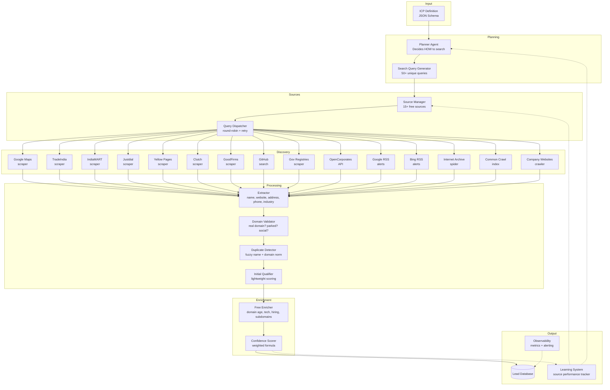
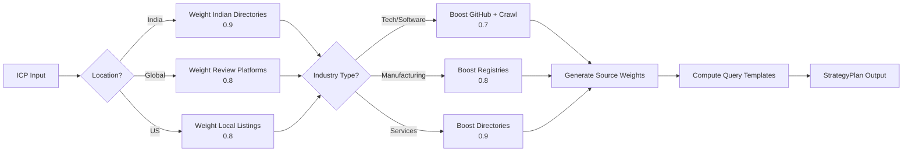
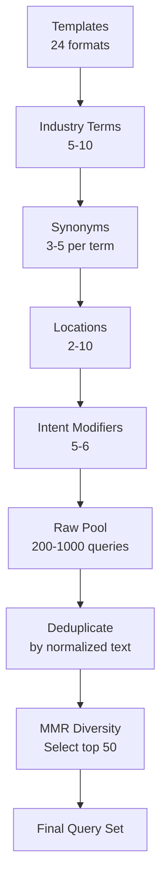
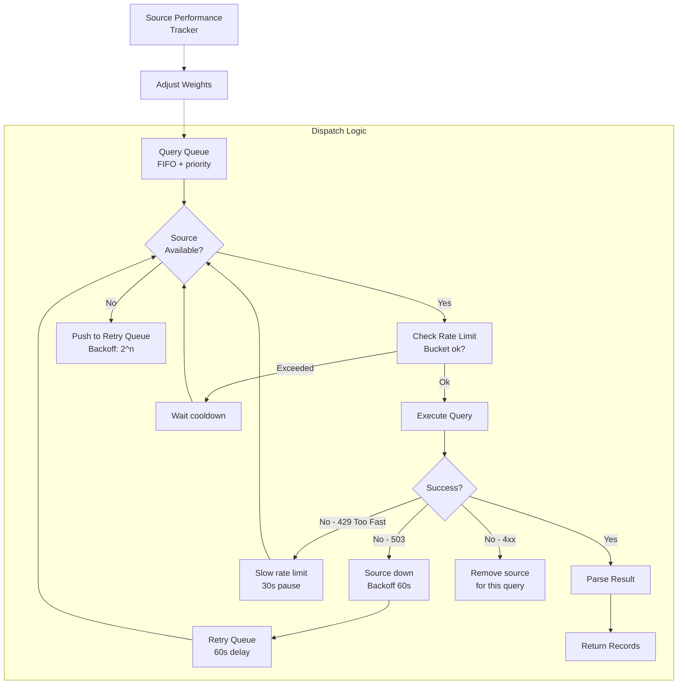
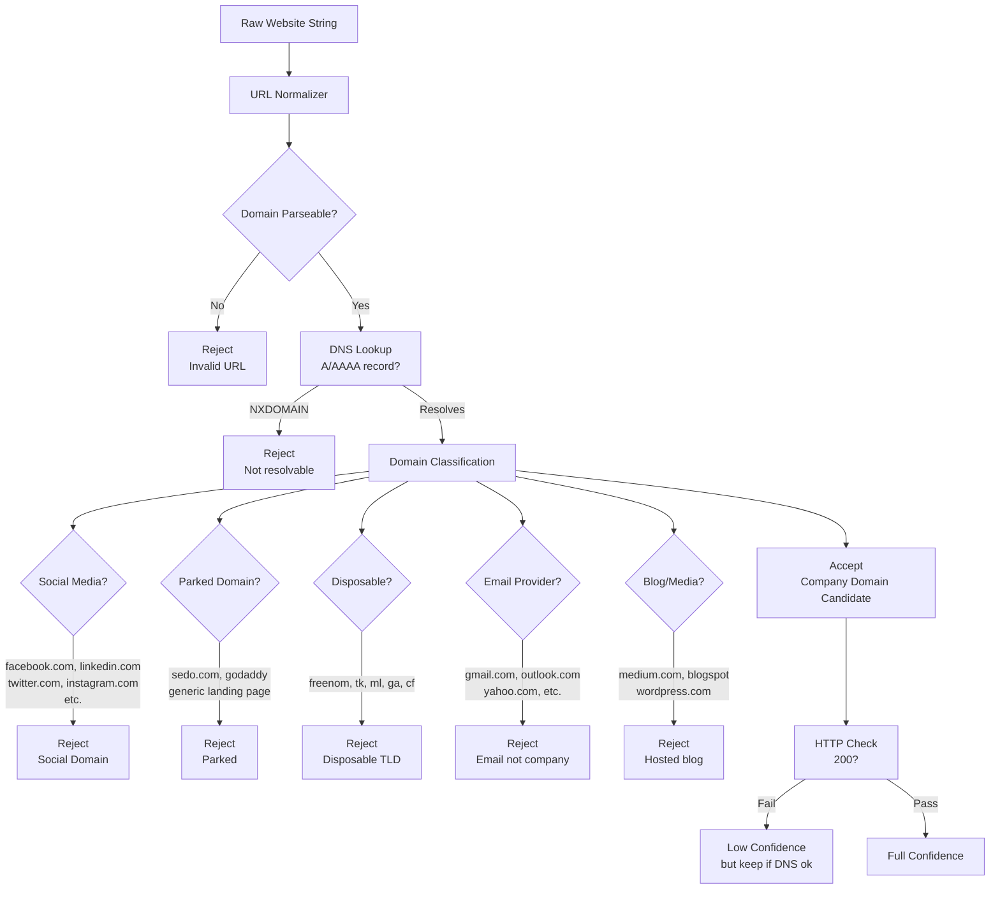
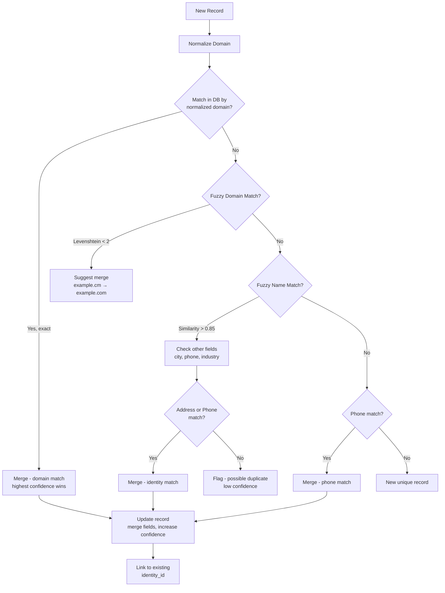
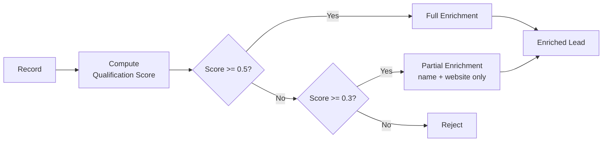
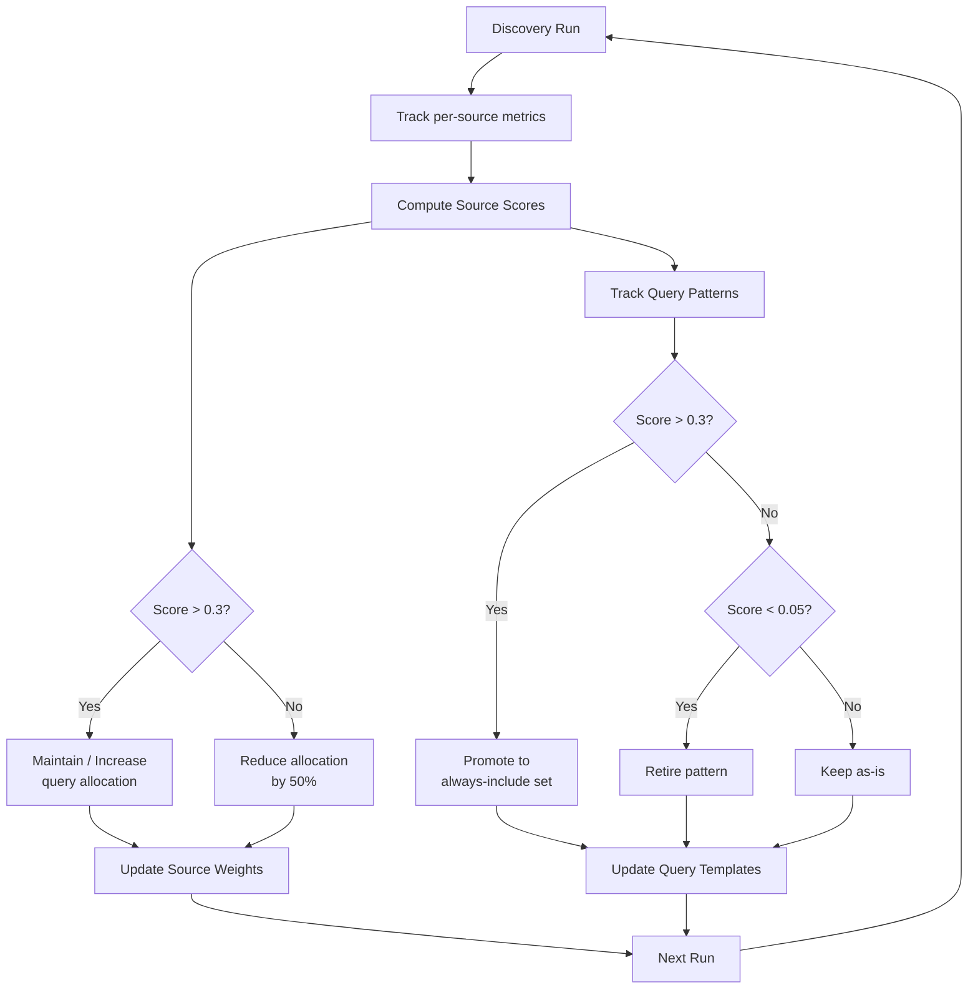
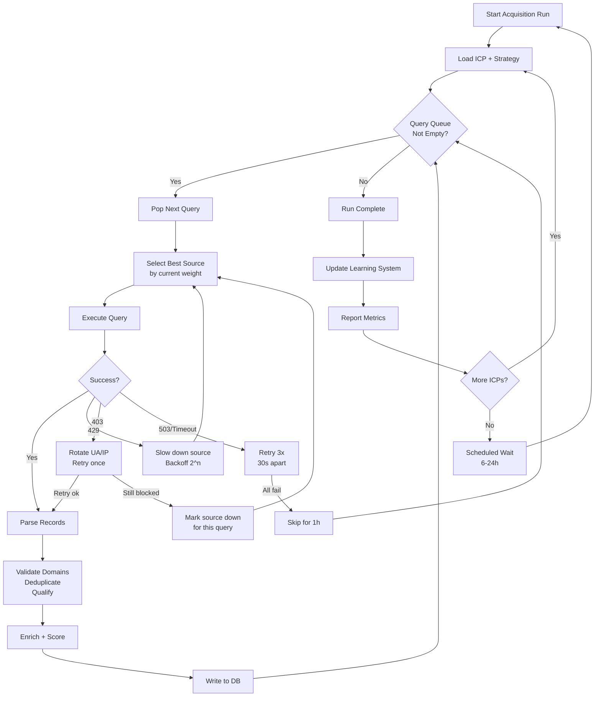

# Layer 0: Autonomous Lead Acquisition Engine

> **Zero-touch pipeline** that discovers companies matching an ICP without manual entry, forms, or paid data brokers. Runs on free public sources, self-heals, and learns which sources yield the best prospects.

---

## Table of Contents

1. [Architecture Overview](#1-architecture-overview)
2. [ICP Definition Schema](#2-icp-definition-schema)
3. [Planner Agent](#3-planner-agent)
4. [Search Query Generator](#4-search-query-generator)
5. [Source Manager](#5-source-manager)
6. [Company Discovery Flow](#6-company-discovery-flow)
7. [Domain Validation](#7-domain-validation)
8. [Duplicate Detection](#8-duplicate-detection)
9. [Initial Qualification](#9-initial-qualification)
10. [Free Enrichment](#10-free-enrichment)
11. [Confidence Score Formula](#11-confidence-score-formula)
12. [Learning System](#12-learning-system)
13. [Autonomous Behavior](#13-autonomous-behavior)
14. [Observability Metrics](#14-observability-metrics)
15. [Cost Estimation](#15-cost-estimation)

---

## 1. Architecture Overview



### Data Flow Summary

| Step | Component | Action | Output |
|------|-----------|--------|--------|
| 0 | ICP Schema | Store structured ICP | JSON config |
| 1 | Planner Agent | Analyse ICP → strategy | Strategy plan |
| 2 | Query Generator | Expand strategy → queries | 50+ query objects |
| 3 | Source Manager | Dispatch queries to sources | Raw HTML/JSON |
| 4 | Extractor | Parse each source result | Structured company records |
| 5 | Domain Validator | Filter invalid domains | Clean records |
| 6 | Duplicate Detector | Merge / deduplicate | Resolved identities |
| 7 | Initial Qualifier | Score & threshold | Qualified leads |
| 8 | Free Enricher | Augment with public data | Enriched leads |
| 9 | Confidence Scorer | Compute final score | Scored leads |
| 10 | Learning System | Track source ROI | Updated weights |
| 11 | Observability | Metrics & alerts | Dashboard data |

---

## 2. ICP Definition Schema

```json
{
  "$schema": "https://json-schema.org/draft/2020-12/schema",
  "type": "object",
  "properties": {
    "industries": {
      "type": "array",
      "items": { "type": "string" },
      "description": "Target industries (NAICS or free-text)"
    },
    "subIndustries": {
      "type": "array",
      "items": { "type": "string" }
    },
    "locations": {
      "type": "array",
      "items": {
        "type": "object",
        "properties": {
          "country": { "type": "string" },
          "state": { "type": "string" },
          "city": { "type": "string" },
          "radius": { "type": "number", "description": "km radius from city center" }
        }
      }
    },
    "companySizeMin": { "type": "integer", "description": "Min employees" },
    "companySizeMax": { "type": "integer", "description": "Max employees" },
    "revenueMin": { "type": "number", "description": "Min annual revenue in USD" },
    "revenueMax": { "type": "number" },
    "techStack": {
      "type": "array",
      "items": { "type": "string" },
      "description": "Technologies used (e.g. 'Shopify', 'Python', 'AWS')"
    },
    "keywords": {
      "type": "array",
      "items": { "type": "string" },
      "description": "Business keywords to match in descriptions"
    },
    "excludeKeywords": {
      "type": "array",
      "items": { "type": "string" },
      "description": "Keywords that disqualify a company"
    },
    "minimumFieldsPresent": {
      "type": "integer",
      "default": 3,
      "description": "Min fields needed to accept (name, website, address, phone, industry)"
    },
    "confidenceThreshold": {
      "type": "number",
      "default": 0.6,
      "description": "Minimum confidence score (0-1) to enter pipeline"
    },
    "sources": {
      "type": "array",
      "items": { "type": "string" },
      "description": "Override: limit to specific sources"
    },
    "active": {
      "type": "boolean",
      "default": true
    }
  }
}
```

### Example ICP

```json
{
  "industries": ["Software Development", "IT Services"],
  "subIndustries": ["Web Development", "Mobile App Development", "Custom Software"],
  "locations": [
    { "country": "India", "city": "Ahmedabad", "radius": 50 },
    { "country": "India", "city": "Surat", "radius": 50 }
  ],
  "companySizeMin": 10,
  "companySizeMax": 500,
  "techStack": ["React", "Node.js", "PHP"],
  "keywords": ["software development", "web development", "mobile app", "it services"],
  "excludeKeywords": ["staffing", "recruitment", "consulting only"],
  "minimumFieldsPresent": 4,
  "confidenceThreshold": 0.6,
  "active": true
}
```

---

## 3. Planner Agent

The Planner Agent receives an ICP and produces a **search strategy plan** — a structured set of instructions for the Query Generator and Source Manager.

### Algorithm

```
Input: ICP object
Output: StrategyPlan

1. Parse ICP.industries → extract primary and synonym terms
2. Parse ICP.locations → extract country/city/state lists
3. Parse ICP.techStack → convert to searchable phrases
4. Determine source priority based on location:
   - If country == "India" → weight TradeIndia, IndiaMART, Justdial higher
   - If global → weight Clutch, GoodFirms, OpenCorporates higher
   - If US-heavy → weight Yellow Pages, Google Maps higher
   - If tech-heavy → weight GitHub, company websites higher
5. Estimate query volume:
   - 5 industry terms × 3 synonym sets × 4 locations × 2 intent variants = 120 queries
   - Target 50 unique queries per run
6. Output StrategyPlan
```

### StrategyPlan Schema

```json
{
  "queryTemplates": ["{industry} in {city}", "{keyword} companies {city}"],
  "sourceWeights": { "googleMaps": 0.8, "tradeIndia": 0.9, "clutch": 0.5 },
  "synonymMap": {
    "software development": ["software dev", "software engineering", "app development", "custom software"],
    "web development": ["web dev", "website development", "web design", "frontend development"]
  },
  "intentModifiers": ["company", "firm", "agency", "service provider", "vendor", "business"],
  "locations": ["Ahmedabad", "Surat"],
  "estimatedQueries": 60,
  "maxQueriesPerRun": 50
}
```

### Mermaid: Planner Decision Logic



---

## 4. Search Query Generator

Generates 50+ unique search queries by varying **industry keywords**, **synonyms**, **locations**, **intent modifiers**, and **query format**.

### Algorithm

```
Input: StrategyPlan, seed ICP
Output: List<SearchQuery>

QUERIES = []
templates = [
  "{industry} {city}",
  "{industry} in {city}",
  "{industry} companies in {city}",
  "{synonym} {city}",
  "{synonym} in {city}",
  "{keyword} {city} {intent}",
  "{city} based {industry} {intent}",
  "best {industry} {city}",
  "top {industry} firms in {city}",
  "{city} {industry} service providers",
  "{industry} near {city}",
  "{intent} in {city} {industry}",
  "{synonym} services {city}",
  "{industry} {city} address phone",
  "list of {industry} companies in {city}",
  "{industry} vendors in {city}",
  "{city} {techStack} developers",
  "{techStack} agency {city}",
  "{techStack} company {city}",
  "custom {industry} {city}",
  "{city} leading {industry} firms",
  "{industry} consultants {city}",
  "{industry} {state}",
  "{industry} companies {state}",
  "top {industry} in {country}",
]

FOR EACH template IN templates:
    FOR EACH industry IN ICP.industries:
        FOR EACH synonym IN synonymMap[industry]:
            FOR EACH location IN locations:
                FOR EACH intent IN intentModifiers:
                    query = fillTemplate(template, {industry, synonym, location, intent})
                    QUERIES.append({query, sourceStrategy, priority})

DEDUPLICATE by normalized query text
SELECT top 50 by diversity score (maximise edit distance between selected queries)
RETURN sorted by priority
```

### Diversity Selection Algorithm

To avoid 50 near-identical queries, use **maximum marginal relevance (MMR)**:

```
MMR(Q) = argmax [ λ·Relevance(q) - (1-λ)·max(Sim(q, qi)) ]

Where:
  λ = 0.7 (trade-off between relevance and diversity)
  Relevance(q) = priority score from strategy plan
  Sim(q, qi) = Jaccard similarity of token sets
```

### Query Object Schema

```json
{
  "text": "React development companies in Ahmedabad",
  "sourceStrategy": ["googleMaps", "tradeIndia", "justdial"],
  "priority": 0.85,
  "tokens": ["react", "development", "companies", "ahmedabad"],
  "synonymGroup": "software development",
  "location": "Ahmedabad",
  "intent": "company"
}
```

### Mermaid: Query Generation Pipeline



---

## 5. Source Manager

Manages 15+ free data sources with rate limiting, retry logic, and adaptive throttling.

### Source Registry

| # | Source | Type | Rate Limit | Cooldown | Notes |
|---|--------|------|-----------|----------|-------|
| 1 | Google Maps | Scraper | 10 req/min | 6s | Via Places API + fallback scrap |
| 2 | TradeIndia | Scraper | 30 req/min | 2s | Indian B2B directory |
| 3 | IndiaMART | Scraper | 20 req/min | 3s | Indian B2B marketplace |
| 4 | Justdial | Scraper | 15 req/min | 4s | Indian local search |
| 5 | Yellow Pages | Scraper | 20 req/min | 3s | Global business directory |
| 6 | Clutch | Scraper | 10 req/min | 6s | B2B ratings/reviews |
| 7 | GoodFirms | Scraper | 10 req/min | 6s | B2B research platform |
| 8 | GitHub | API | 60 req/hr | 60s | Code repos, org profiles |
| 9 | Gov Registries | Scraper | Varies | Custom | MCA21 (India), Companies House (UK) |
| 10 | OpenCorporates | API | 5 req/sec | 1s | Open company data |
| 11 | Google RSS | RSS | 100 req/hr | 36s | Topic-based alerts |
| 12 | Bing RSS | RSS | 100 req/hr | 36s | Topic-based alerts |
| 13 | Internet Archive | API/Scraper | 10 req/min | 6s | Historical snapshots |
| 14 | Common Crawl | Index | 50 req/hr | 72s | Pre-crawled page index |
| 15 | Company Websites | Custom Crawler | 1 req/domain | N/A | Fetches specific domains |

### Query Dispatcher



### Adaptive Rate Limiting

Each source uses a **token bucket** algorithm:

```
capacity = maxBurst (e.g., 10)
tokens = capacity
refillRate = perSecond (e.g., 0.17 for 10/min)
lastRefill = now()

onRequest():
    now = currentTime()
    elapsed = now - lastRefill
    tokens = min(capacity, tokens + elapsed * refillRate)
    lastRefill = now
    if tokens < 1:
        waitTime = (1 - tokens) / refillRate
        sleep(waitTime)
    tokens -= 1
    return execute()
```

When a 429 is received: `backoff = min(backoff * 2, 300)` seconds, reset on success.

---

## 6. Company Discovery Flow

### Mermaid: End-to-End Discovery

```mermaid
flowchart TB
    subgraph Source Query
        A[Source Manager<br/>dispatches query] --> B[HTTP GET<br/>with headers & cookies]
        B --> C[Raw HTML / JSON<br/>response]
    end

    subgraph Parsing Layer
        C --> D{Source Type}
        D -->|Google Maps| E[Maps Parser<br/>name, address, phone, website, rating]
        D -->|TradeIndia| F[TradeIndia Parser<br/>name, products, location, phone]
        D -->|IndiaMART| G[IndiaMART Parser<br/>company, contact, catalog]
        D -->|Justdial| H[Justdial Parser<br/>name, address, rating, website]
        D -->|Yellow Pages| I[YPParser<br/>business, phone, website, categories]
        D -->|Clutch| J[Clutch Parser<br/>company, services, link, location]
        D -->|GoodFirms| K[GoodFirms Parser<br/>name, profile, services]
        D -->|GitHub| L[GitHub Parser<br/>org, repos, location, website]
        D -->|OpenCorporates| M[OC Parser<br/>company, jurisdiction, status]
        D -->|Gov Registry| N[Gov Parser<br/>registration, address, directors]
        D -->|RSS/Feed| O[RSS Parser<br/>title, link, description]
        D -->|Internet Archive| P[IA Parser<br/>domain, snapshots, metadata]
        D -->|Common Crawl| Q[CC Parser<br/>domain, text, links]
        D -->|Company Crawler| R[Crawler Parser<br/>meta, headers, content]
    end

    subgraph Normalized Fields
        E & F & G & H & I & J & K & L & M & N & O & P & Q & R --> S[Extract Fields]
        S --> T{Has name<br/>and website?}
        T -->|Yes| U[Structured Record<br/>{name, website, address, phone, industry}]
        T -->|No| V[Partial Record<br/>{name} + whatever found]
        V --> U
    end

    subgraph Acceptance
        U --> W{Fields Present >=<br/>minRequired?}
        W -->|Yes| X[Accept Record]
        W -->|No| Y[Reject - insufficient<br/>data]
    end
```

### Extractable Fields per Source

| Source | Name | Website | Address | Phone | Industry | Email | Rating |
|--------|------|---------|---------|-------|----------|-------|--------|
| Google Maps | ✓ | ✓ | ✓ | ✓ | ✓ (category) | ✗ | ✓ |
| TradeIndia | ✓ | ✓ | ✓ | ✓ | ✓ | ✓ | ✗ |
| IndiaMART | ✓ | ✓ | ✓ | ✓ | ✓ | ✓ | ✓ |
| Justdial | ✓ | ✓ | ✓ | ✓ | ✓ | ✗ | ✓ |
| Yellow Pages | ✓ | ✓ | ✓ | ✓ | ✓ | ✗ | ✓ |
| Clutch | ✓ | ✓ | ✗ | ✗ | ✓ | ✗ | ✓ |
| GoodFirms | ✓ | ✓ | ✗ | ✗ | ✓ | ✗ | ✓ |
| GitHub | ✓ | ✓ (org) | ✗ | ✗ | ✓ (topic) | ✗ | ✗ |
| OpenCorporates | ✓ | ✗ | ✓ | ✗ | ✓ (SIC) | ✗ | ✗ |
| Gov Registry | ✓ | ✗ | ✓ | ✗ | ✓ (code) | ✗ | ✗ |
| RSS | ✗ | ✓ | ✗ | ✗ | ✓ | ✗ | ✗ |
| Company Crawler | ✓ | ✓ | ✓ | ✓ | ✓ | ✓ | ✗ |

---

## 7. Domain Validation

Validates discovered domains and rejects non-commercial or throwaway domains.

### Validation Pipeline



### Domain Normalizer

```
Input: rawWebsite
Output: normalizedDomain or null

1. Strip protocol (http://, https://)
2. Strip 'www.' prefix (or 'www2.', 'ww2.')
3. Strip trailing slash, index.html, index.php
4. Lowercase
5. Remove query params and fragments
6. Parse with public suffix list:
   - Extract registrable domain (e.g., 'example.com' from 'sub.example.co.uk')
7. If no TLD match → null
8. Return normalized domain
```

### Rejection Rules

```python
SOCIAL_DOMAINS = {
    'facebook.com', 'linkedin.com', 'twitter.com', 'x.com',
    'instagram.com', 'youtube.com', 'tiktok.com', 'pinterest.com',
    'medium.com', 'reddit.com', 'quora.com', 'github.io', 'blogspot.com',
    'wordpress.com', 'wixsite.com', 'weebly.com', 'squarespace.com',
}
PARKED_KEYWORDS = ['buy this domain', 'domain is parked', 'coming soon',
                   'under construction', 'this domain is for sale']
DISPOSABLE_TLDS = {'.tk', '.ml', '.ga', '.cf', '.gq', '.xyz', '.top'}
EMAIL_DOMAINS = {'gmail.com', 'yahoo.com', 'outlook.com', 'hotmail.com',
                 'aol.com', 'protonmail.com', 'mail.com', 'zoho.com'}
```

---

## 8. Duplicate Detection

Resolves records pointing to the same company across multiple sources.

### Mermaid: Deduplication Pipeline



### Domain Normalization for Dedup

```
1. Remove protocol, www, trailing slash
2. Lowercase
3. Remove common subdomains: 'www', 'ww2', 'ww3', 'mail', 'email', 'web', 'home', 'shop', 'store'
4. If no subdomain remains, keep as-is
5. Examples:
   'WWW.Example.Com/' → 'example.com'
   'https://www.example.co.uk/index.html' → 'example.co.uk'
   'mail.example.com' → 'example.com'
   'blog.example.com' → 'example.com'
```

### Fuzzy Name Matching

Use **token-set ratio** from RapidFuzz (Python) or equivalent:

```python
def fuzzy_name_match(name1: str, name2: str) -> float:
    # Preprocess
    n1 = clean_name(name1)
    n2 = clean_name(name2)
    # Token set ratio handles word reordering and subsets
    return fuzz.token_set_ratio(n1, n2) / 100.0  # 0-1

def clean_name(name: str) -> str:
    name = name.lower()
    name = re.sub(r'[^a-z0-9\s]', '', name)
    name = re.sub(r'\b(inc|llc|ltd|limited|corp|corporation|pvt|private|technologies|technology|systems|system|solutions|solution|group|services|service|consulting|consultants|international|intl|global|enterprises|enterprise|industries|industry)\b', '', name)
    name = re.sub(r'\s+', ' ', name).strip()
    return name
```

### Merge Resolution

When a duplicate is found, apply these rules:

| Field | Resolution Strategy |
|-------|-------------------|
| Name | Prefer longer, more complete name |
| Website | Prefer https over http, prefer non-subdomain |
| Address | Prefer most complete, GPS-validated |
| Phone | Union all phones found |
| Industry | Majority vote across sources |
| Confidence | `max(current, incoming)` |

---

## 9. Initial Qualification

A lightweight scoring pass before full enrichment to avoid wasting resources on poor records.

### Qualification Criteria

| Criterion | Weight | Score Function |
|-----------|--------|---------------|
| Has website | 0.25 | 1.0 if valid domain, 0.3 if placeholder, 0 if none |
| Has phone | 0.15 | 1.0 if present, 0 if absent |
| Has address | 0.15 | 1.0 if city/country identifiable |
| Industry match | 0.25 | 1.0 if industry in ICP list, 0.5 if related, 0 if unknown |
| Location match | 0.20 | 1.0 if in target city, 0.7 if in target state, 0.3 if in target country |

```
QualificationScore = Σ(weight_i × score_i)

Threshold:
  QualificationScore >= 0.50 → Full enrichment
  QualificationScore < 0.30 → Reject
  Else → Partial enrichment (name + website only)
```

### Mermaid: Qualification Decision



---

## 10. Free Enrichment

Augments leads using entirely free public data sources.

### Enrichment Sources

| Signal | Source | Method | Free Tier Limit |
|--------|--------|--------|---------------|
| Domain Age | WHOIS / Whoxy | WHOIS lookup | 10/day (Whoxy free) |
| Domain Age | Internet Archive | API first-snapshot | Unlimited |
| DNS Records | DNS lookup | `nslookup`, `dig` | Unlimited |
| Subdomains | Certificate Transparency (crt.sh) | API query | Unlimited |
| Subdomains | Sublist3r | Open-source tool | Unlimited |
| Tech Stack | BuiltWith (partial) | Free API | 10/day |
| Tech Stack | Wappalyzer | Open-source lib | Unlimited (self-run) |
| Tech Stack | WhatRuns | Chrome extension | Unlimited |
| Social Links | Google Search | `site:domain` | 100/day (free tier) |
| Social Links | OpenCorporates | API | 500/day |
| Hiring Signals | Google Jobs RSS | `site:linkedin.com/jobs "domain"` | Unlimited |
| Hiring Signals | Indeed RSS | Company name search | Unlimited |
| Recent News | Google News RSS | Domain/company query | Unlimited |
| SSL Info | crt.sh | API | Unlimited |
| Page Title/Meta | HTTP fetch | Direct GET | Unlimited |
| Email Patterns | Hunter.io (partial) | Free tier | 25/month |
| Email Patterns | Skymem | Free search | 20/day |
| Employees | LinkedIn (public) | Scrape search results | 10/day |

### Enrichment Result Schema

```json
{
  "domainAge": { "years": 12, "created": "2012-03-15", "source": "whois" },
  "techStack": ["React", "Node.js", "AWS", "Cloudflare"],
  "subdomains": ["www", "mail", "blog", "app", "api", "careers"],
  "hiringSignals": [
    { "role": "Senior React Developer", "source": "linkedin", "date": "2025-06-10" },
    { "role": "Full Stack Engineer", "source": "indeed", "date": "2025-06-08" }
  ],
  "recentNews": [
    { "title": "Company Raises $2M Seed Round", "source": "techcrunch", "date": "2025-05-20" }
  ],
  "socialLinks": {
    "linkedin": "https://linkedin.com/company/example",
    "twitter": "https://twitter.com/example",
    "facebook": "https://facebook.com/example"
  },
  "employees": 75,
  "annualRevenue": "$5M - $10M (estimated)",
  "pageTitle": "Example Corp - Web Development Agency",
  "metaDescription": "Example Corp provides custom web and mobile development services."
}
```

---

## 11. Confidence Score Formula

The confidence score quantifies how reliable and complete a lead record is.

### Components

| Component | Symbol | Range | Weight |
|-----------|--------|-------|--------|
| Field Completeness | C | 0-1 | 0.20 |
| Source Authority | A | 0-1 | 0.20 |
| Domain Quality | D | 0-1 | 0.15 |
| Enrichment Level | E | 0-1 | 0.15 |
| Duplicate Verification | V | 0-1 | 0.10 |
| ICP Fit | F | 0-1 | 0.20 |

### Formula

```
Confidence = 0.20×C + 0.20×A + 0.15×D + 0.15×E + 0.10×V + 0.20×F
```

#### Field Completeness (C)

```
C = (hasName + hasWebsite + hasAddress + hasPhone + hasIndustry) / 5

Where each is 1.0 if present, 0.0 if absent.
```

#### Source Authority (A)

```
A = max(sourceWeight for each source that found this record)

Source weights:
  OpenCorporates/GovReg  → 1.0  (authoritative registries)
  Google Maps            → 0.9  (verified listing)
  Clutch/GoodFirms       → 0.85 (reviewed profile)
  TradeIndia/IndiaMART   → 0.8  (business listing)
  Justdial/Yellow Pages  → 0.75 (directory listing)
  GitHub                 → 0.7  (organisation verified)
  Company Crawler        → 0.6  (direct fetch)
  Common Crawl           → 0.5  (indexed page)
  RSS/IA                 → 0.4  (indirect mention)

If multiple sources: A = weighted average across sources.
```

#### Domain Quality (D)

```
D = 0.3×dnsExists + 0.3×httpOk + 0.2×hasSSL + 0.2×domainAgeScore

dnsExists = 1.0 if A record resolves, else 0.0
httpOk = 1.0 if 200, 0.5 if 3xx, 0.0 if 4xx/5xx
hasSSL = 1.0 if valid cert, 0.0 otherwise
domainAgeScore = min(years / 10, 1.0)
```

#### Enrichment Level (E)

```
E = (techDetected + hiringDetected + socialDetected + pageContentDetected) / 4

Each = 1.0 if signal present, 0.0 otherwise.
```

#### Duplicate Verification (V)

```
V = 1.0 if confirmed by 2+ sources
V = 0.5 if single source
V = 0.3 if fuzzy match only
```

#### ICP Fit (F)

```
F = 0.4×industryMatch + 0.3×locationMatch + 0.2×sizeMatch + 0.1×techMatch

industryMatch = 1.0 if in ICP list, 0.5 if related, 0.0 if unknown
locationMatch = 1.0 if city match, 0.7 if state, 0.3 if country, 0.0 otherwise
sizeMatch = 1.0 if employees in ICP range, 0.5 if unknown, 0.0 if outside
techMatch = (matchedTechCount / icpTechCount) capped at 1.0
```

### Classification

| Score Range | Classification | Action |
|-------------|---------------|--------|
| 0.80 - 1.00 | Hot Lead | Immediate outreach |
| 0.60 - 0.79 | Warm Lead | Enter nurture pipeline |
| 0.40 - 0.59 | Lukewarm | Re-enrich in 30 days |
| 0.00 - 0.39 | Cold / Invalid | Archive or discard |

---

## 12. Learning System

The engine learns from its own performance to improve future runs.

### Source Performance Tracking

For each source, track:

```json
{
  "sourceName": "tradeIndia",
  "totalQueries": 240,
  "successfulQueries": 215,
  "totalRecords": 1842,
  "uniqueRecords": 1203,
  "qualifiedRecords": 487,
  "enrichedRecords": 312,
  "avgConfidence": 0.72,
  "successRate": 0.896,
  "uniquenessRate": 0.653,
  "qualityRate": 0.264,
  "score": 0.421
}
```

### Source Score

```
SourceScore = 0.3 × successRate + 0.3 × uniquenessRate + 0.4 × qualityRate

Where:
  successRate = successfulQueries / totalQueries
  uniquenessRate = uniqueRecords / totalRecords
  qualityRate = qualifiedRecords / totalRecords
```

### Priority Adjustment

After each run (or every N records), adjust source priorities:

```
newWeight = oldWeight × 0.7 + SourceScore × 0.3
```

Sources below 0.1 for 3 consecutive runs are **paused** and only retried weekly.

### Query Effectiveness

Track which query patterns yield results:

```
QueryScore = hits / impressions

hits = number of unique companies discovered from this query pattern
impressions = number of times this query pattern was dispatched

Patterns with QueryScore < 0.05 are retired automatically.
Patterns with QueryScore > 0.3 are promoted to "always include."
```

### Feedback Loop Diagram



---

## 13. Autonomous Behavior

The engine self-heals and adapts without human intervention.

### Failure Recovery Matrix

| Failure Mode | Detection | Recovery Action |
|-------------|-----------|----------------|
| HTTP 429 (rate limit) | Response code | Exponential backoff, switch sources |
| HTTP 403 (blocked) | Response code | Rotate user-agent, add delay, try different source |
| HTTP 503 (down) | Response code | Retry 3x with 30s gap, then skip source for 1h |
| DNS resolution fail | Exception | Retry with different DNS (1.1.1.1, 8.8.8.8) |
| Empty results page | No records found | Try next page, then try alternative query |
| Timeout (>30s) | Socket timeout | Abort, retry once, then skip |
| CAPTCHA detected | CAPTCHA challenge text | Skip source, report to observability |
| IP banned | All requests 4xx | Rotate proxy, cooldown 30min |
| Source schema changed | Parser returns null fields | Log alert, use raw text extraction as fallback |
| No new records (stale) | All records are duplicates | Signal planner to generate new query variants |

### Autonomous Loop



### Graceful Degradation

If fewer than 3 sources are available at any time, the engine enters **conservation mode**:

```
Conservation Mode:
1. Reduce query concurrency to 1
2. Increase cooldown between queries by 2x
3. Pause enrichment (only collect raw records)
4. Log alert: "Engine in conservation mode - limited sources available"
5. Exit conservation mode when 5+ sources recover
```

---

## 14. Observability Metrics

### Key Metrics

| Metric | Type | Description | Alert Threshold |
|--------|------|-------------|----------------|
| `acquisition.records_discovered` | Counter | Total raw records found | — |
| `acquisition.records_qualified` | Counter | Passed initial qualification | — |
| `acquisition.records_enriched` | Counter | Successfully enriched | — |
| `acquisition.duplicate_rate` | Gauge | duplicate / discovered | > 0.8 (stale data) |
| `acquisition.source_success_rate` | Gauge | Per source | < 0.5 |
| `acquisition.queries_per_run` | Histogram | Queries dispatched | < 10 (too few) |
| `acquisition.avg_confidence` | Gauge | Mean confidence score | < 0.4 |
| `acquisition.source_health` | Gauge | 1 = healthy, 0 = down | < 5 sources healthy |
| `acquisition.crawl_speed` | Gauge | Records per minute | < 1 |
| `acquisition.error_rate` | Gauge | failed / total | > 0.3 |
| `acquisition.query_diversity` | Gauge | Unique templates used | < 5 |
| `acquisition.full_pipeline_time` | Histogram | End-to-end run duration | — |

### Logging Schema

Every event logs a structured JSON line:

```json
{
  "timestamp": "2025-07-12T10:30:00Z",
  "event": "query_dispatched",
  "source": "tradeIndia",
  "query": "React development companies in Ahmedabad",
  "duration": 3.2,
  "status": "success",
  "records": 18,
  "error": null
}
```

### Health Endpoint

```
GET /health
{
  "status": "running",
  "uptime": 3600,
  "sourcesHealthy": 12,
  "sourcesDown": ["justdial"],
  "recordsToday": 1450,
  "queueDepth": 23,
  "conservationMode": false,
  "lastRunDuration": 420
}
```

---

## 15. Cost Estimation

The engine is designed to run at **near-zero cost** using only free tiers and open-source tools.

### Infrastructure Costs

| Component | Service | Free Tier | Cost at Scale |
|-----------|---------|-----------|---------------|
| Execution | GitHub Actions / AWS Lambda | 2000 min/month free | $0 |
| Execution | Local cron (existing machine) | Unlimited | $0 |
| Database | SQLite (local) / Turso (cloud) | SQLite free; Turso 9GB free | $0 |
| Database | Supabase | 500 MB free | $0 |
| Scraping | Playwright/Puppeteer | Open-source, local | $0 |
| Proxies | Rotating user-agents only | No proxies needed | $0 |
| DNS | Cloudflare / Google DNS | Free | $0 |
| Monitoring | Prometheus + Grafana | Self-hosted | $0 |
| Logging | stdout / file rotation | Free | $0 |

### API Key Dependent Services (Optional)

| Service | Free Tier Limit | Monthly Records | Cost |
|---------|----------------|-----------------|------|
| OpenCorporates API | 500/day | 15,000 | $0 |
| Whoxy (WHOIS) | 10/day | 300 | $0 |
| Hunter.io (email) | 25/month | 25 | $0 |
| SecurityTrails (DNS) | 50/month | 50 | $0 |
| Google Custom Search | 100/day | 3,000 | $0 |

### Estimated Monthly Capacity

| Resource | Limit | Estimated Records |
|----------|-------|------------------|
| Compute (GitHub Actions) | 2000 min/mo | ~400,000 page fetches |
| OpenCorporates API | 15,000/mo | 15,000 companies |
| Web scraping (no proxy) | Unlimited (rate-limited) | 50,000 - 200,000 records |
| Database storage | 500 MB | ~500,000 company records |

### Cost Breakdown Table

| Scenario | Monthly Cost | Records/Month |
|----------|-------------|---------------|
| Minimal (local, no APIs) | $0 | 10,000 - 50,000 |
| Standard (GitHub Actions + OpenCorporates) | $0 | 50,000 - 200,000 |
| High-volume (paid proxies + all APIs) | ~$50/mo | 500,000+ |

### Why It's Near-Zero

1. **Direct scraping** does not require paid proxies for the listed sources (they do not aggressively block)
2. **All sources** have free tiers that cover discovery of 10,000+ companies monthly
3. **Enrichment** uses WHOIS, crt.sh, HTTP fetches — all free and unlimited
4. **Compute** runs on existing infrastructure or CI/CD free minutes
5. **Storage** is lightweight (JSON/CSV, text-heavy, no binaries)

---

## Appendix A: ICP Stored Procedure

```sql
-- Schema for ICP definitions and run history
CREATE TABLE icp_definitions (
    id TEXT PRIMARY KEY,
    name TEXT NOT NULL,
    config JSON NOT NULL,
    active BOOLEAN DEFAULT 1,
    created_at TIMESTAMP DEFAULT CURRENT_TIMESTAMP,
    updated_at TIMESTAMP DEFAULT CURRENT_TIMESTAMP
);

CREATE TABLE acquisition_runs (
    id TEXT PRIMARY KEY,
    icp_id TEXT REFERENCES icp_definitions(id),
    status TEXT CHECK(status IN ('running', 'completed', 'failed')),
    queries_dispatched INTEGER DEFAULT 0,
    records_discovered INTEGER DEFAULT 0,
    records_qualified INTEGER DEFAULT 0,
    records_enriched INTEGER DEFAULT 0,
    avg_confidence REAL,
    started_at TIMESTAMP,
    finished_at TIMESTAMP,
    error TEXT
);

CREATE TABLE source_performance (
    id TEXT PRIMARY KEY,
    icp_id TEXT REFERENCES icp_definitions(id),
    source_name TEXT NOT NULL,
    total_queries INTEGER DEFAULT 0,
    successful_queries INTEGER DEFAULT 0,
    total_records INTEGER DEFAULT 0,
    unique_records INTEGER DEFAULT 0,
    qualified_records INTEGER DEFAULT 0,
    score REAL DEFAULT 0.5,
    last_used TIMESTAMP,
    UNIQUE(icp_id, source_name)
);

CREATE TABLE query_performance (
    id TEXT PRIMARY KEY,
    pattern TEXT NOT NULL,
    impressions INTEGER DEFAULT 0,
    hits INTEGER DEFAULT 0,
    score REAL DEFAULT 0.0,
    retired BOOLEAN DEFAULT 0,
    promoted BOOLEAN DEFAULT 0,
    last_used TIMESTAMP
);
```

## Appendix B: Record Schema

```json
{
  "identity_id": "uuid",
  "name": "Example Corp",
  "normalized_domain": "example.com",
  "raw_domains": ["www.example.com", "examplecorp.com"],
  "addresses": [
    { "street": "123 Main St", "city": "Ahmedabad", "state": "Gujarat", "country": "India", "pincode": "380001" }
  ],
  "phones": ["+91-79-12345678", "+91-9876543210"],
  "industries": ["Software Development", "Web Development"],
  "sources": ["tradeIndia", "justdial", "googleMaps"],
  "confidence_score": 0.78,
  "qualification_score": 0.65,
  "enrichment": { ... },
  "status": "warm",
  "first_seen": "2025-07-12T10:00:00Z",
  "last_updated": "2025-07-12T12:00:00Z",
  "icp_id": "icp-001"
}
```

---

## Appendix C: Query Concurrency & Throttling

| Source | Max Concurrency | Min Interval | Burst | Daily Limit |
|--------|----------------|-------------|-------|-------------|
| Google Maps | 2 | 6s | 5 | 500 |
| TradeIndia | 3 | 2s | 10 | 2000 |
| IndiaMART | 2 | 3s | 8 | 1500 |
| Justdial | 1 | 4s | 5 | 1000 |
| Yellow Pages | 2 | 3s | 8 | 1500 |
| Clutch | 1 | 6s | 3 | 200 |
| GoodFirms | 1 | 6s | 3 | 200 |
| GitHub | 1 | 60s | 1 | 60/hr |
| OpenCorporates | 3 | 1s | 5 | 500 |

---

*Last updated: 2025-07-12*
